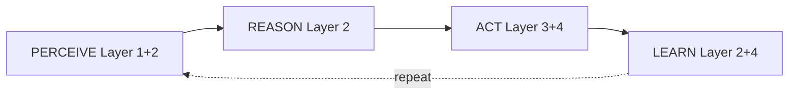
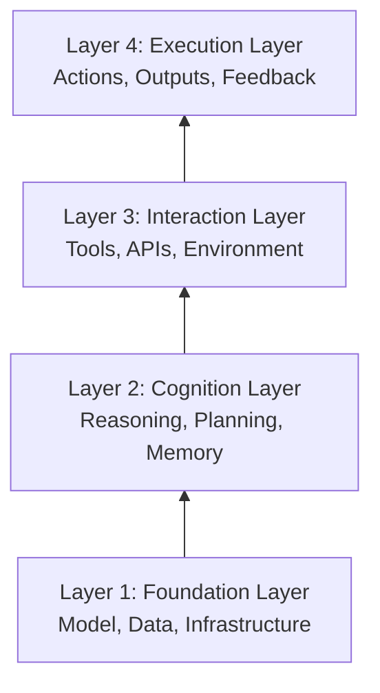

# 4 Layer Agent architecture

Agentic framework can be visualised as four layer system. These components work together to form the cognitive and operational backbone of any autonomous system. This is the core cycle that makes something an "agent" rather than just a tool:

- PERCEIVE: Understand the current situation
- REASON: Think about what to do
- ACT: Execute actions
- LEARN: Update knowledge from results
- REPEAT: Continue the cycle

Modern agentic systems can be viewed as four collaborating layers:

Simple analogy - Human doing a job:
- Layer 1 (Foundation): Your brain, education, knowledge
- Layer 2 (Cognition): Your thinking, planning, memory
- Layer 3 (Interaction): Phone, computer, tools you use
- Layer 4 (Execution): Actually doing tasks, getting results

### Layer 1: Foundation Layer (Model, Data, Infrastructure)

What it is: The base capabilities and resources the agent has access to.

#### Components:

1. Model (The Brain):

- The LLM that powers reasoning (GPT-4, Claude, Llama, etc.)
- Specialized models (vision models, code models, etc.)
- Where inference happens (what we learned earlier!)

2. Data:

- Training data the model learned from
- Knowledge bases, documentation, databases
- Vector stores for RAG (Retrieval Augmented Generation)
- Company-specific data, policies, procedures

3. Infrastructure:

- GPU/CPU resources (Triton Inference Server!)
- Storage systems
- Network connectivity
- Deployment platform (AWS, Azure, on-prem)

### Layer 2: Cognition Layer (Reasoning, Planning, Memory)

What it is: The "thinking" layer where the agent reasons about what to do.

#### Components:

1. Reasoning:

- Chain-of-Thought (step-by-step thinking)
- ReAct (Reason + Act pattern)
- Tree-of-Thoughts (exploring multiple reasoning paths)
- Reflection (self-evaluation and iterative refinement)
- Problem decomposition

2. Planning:

- Breaking complex tasks into steps
- Creating action sequences
- Deciding which tools to use
- Handling multi-step workflows

3. Memory:

- Short-term: Current conversation context (LangGraph checkpointing!)
- Long-term: Past interactions, learned patterns
- Working memory: Intermediate results during reasoning
- Semantic memory: Retrieved knowledge from vector DBs

### Layer 3: Interaction Layer (Tools, APIs, Environment)

What it is: The interfaces through which the agent interacts with the outside world.
Components:

1. Tools/Functions:

- Database queries
- API calls
- File operations
- Search engines
- Calculators
- Code execution

2. APIs:

- Internal company APIs (order system, CRM)
- External APIs (weather, maps, payment processors)
- Third-party integrations (Slack, email, etc.)

3. Environment:

- User interfaces (chat, web, voice)
- External systems the agent can affect
- Communication channels

### Layer 4: Execution Layer (Actions, Outputs, Feedback)

What it is: Where the agent actually performs actions and receives results.

#### Components:

1. Actions:

- Executing the planned steps
- Making API calls
- Generating responses
- Triggering workflows

2. Outputs:

- Text responses to user
- API call results
- Generated artifacts (emails, reports, code)
- System state changes

3. Feedback:

- Success/failure of actions
- User responses
- Error messages
- Metrics and logs

### Mapping to Technologies You Know

| Layer   | NVIDIA Stack         | LangChain/LangGraph | AWS Equivalent     |
|---------|----------------------|---------------------|--------------------|
| Layer 1 | NIM, TensorRT-LLM    | LLM models          | EC2, SageMaker     |
| Layer 2 | NeMo Agent Toolkit   | LangGraph state     | Lambda functions   |
| Layer 3 | AIQ Toolkit tools    | LangChain tools     | API Gateway        |
| Layer 4 | Triton Inference     | Agent executor      | Step Functions     |

### Common Certification Question Patterns
1) Pattern 1: "Where should X be implemented?"
Example: "Where should long-term memory be stored?"

Answer: Layer 2 (Cognition Layer - Memory component)

2) Pattern 2: "What enables the agent to interact with external systems?"
- Answer: Layer 3 (Interaction Layer - Tools, APIs)

3) Pattern 3: "What provides the base reasoning capability?"
- Answer: Layer 1 (Foundation Layer - Model)

4) Pattern 4: "Where does actual task execution happen?"
- Answer: Layer 4 (Execution Layer - Actions)

### Summary Table

| Layer         | Primary Function     | Key Question It Answers | Example Components         |
|---------------|----------------------|-------------------------|----------------------------|
| 1. Foundation | Provides capabilities| "What can I do?"        | LLM, data, GPUs            |
| 2. Cognition  | Thinks and plans     | "What should I do?"     | Reasoning, memory, planning|
| 3. Interaction| Connects to world    | "How do I do it?"       | APIs, tools, interfaces    |
| 4. Execution  | Does the work        | "Did it work?"          | Actions, results, feedback |

References:
- [The Raise of Agentic Ai](https://snyk.io/articles/the-rise-of-agentic-ai-and-what-it-means-for-us/)
- [Multi Agent AI development](https://www.sitepoint.com/multi-agent-ai-development-architecture/)
- [Percieve Reason Act](https://docs.aws.amazon.com/prescriptive-guidance/latest/agentic-ai-foundations/perceive-reason-act.html)
- [Agentic Artificial Intelligence (AI): Architectures, Taxonomies, and Evaluation of Large Language Model Agents](https://arxiv.org/html/2601.12560v1)
- [Cognitive Architecture](https://sema4.ai/learning-center/cognitive-architecture-ai/)
- [Designing Cognitive Architectures: Agentic Workflow Patterns from Scratch](https://medium.com/google-cloud/designing-cognitive-architectures-agentic-workflow-patterns-from-scratch-63baa74c54bc)
