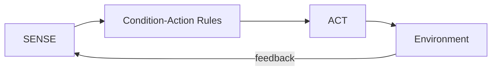
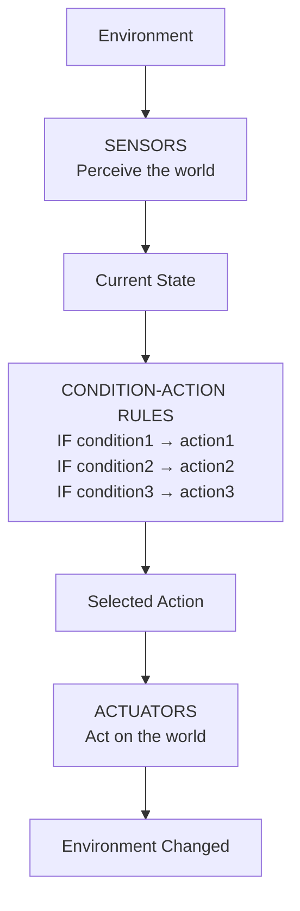
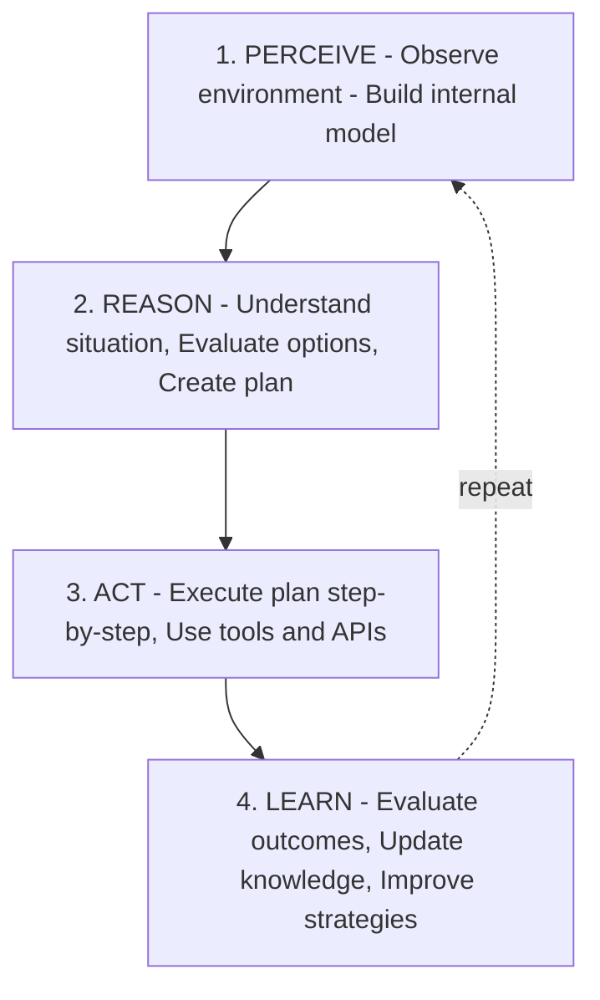

# Types of Agent Architectures

## 1. Reactive Architectures (Sense→Act model)

- **simplest form of agent design**.
- operates on a direct **Sense → Act** loop with **no reasoning, planning, or memory** - so agent responds immediately! Uses predefined tools. This structure is inspired by classical robotics and early AI systems.
- Reactive agents are focused on the speed, efficiency, and direct response to the enviroment.



### The Sense → Act Pattern

**How It Works:**

```
1. SENSE: Perceive current environment state
   ↓
2. MATCH: Find matching condition-action rule (there is no explicit reasoning, planning
   or multi-step thinking involved!)
   ↓
3. ACT: Execute the action immediately
   ↓
4. REPEAT: Go back to SENSE
```

- **No thinking in between!** Just: "If this, then that."
- Ideal for scenarios requiring rapid, deterministic reactions. Everything is derived by immediate trigger.
- Behaviour is governed by rules, triggers, or simple condition-action pairs.
- Fast execution and low latency due to minimal processing overhead
- Highly predictive, consistent behaviour within known environment.

### Architecture Diagram



### Core Components

1. **Sensors (Perception)** - Gather raw environmental data (temperature, proximity, user input, time, battery level)
2. **Condition-Action Rules** - Direct mapping from conditions to actions. Rules have a condition, an action, and optionally a priority. The system finds the first or highest-priority matching rule.
3. **Actuators** - Execute actions on the environment (turn on/off devices, move, send notifications)

Key Characteristics:

- ❌ No internal state
- ❌ No memory of past actions
- ❌ No planning or reasoning or multi-step reasoning
- ❌ Inflexible - difficult to adapt for new or uncertain scenarios
- ❌ No learning
- ❌ Not suitable for open-ended or high variability tasks
- ✅ Immediate stimulus-response
- ✅ Simple condition-action rules
- ✅ Very fast execution
- ✅ Predictable behavior

### Comparison: Reactive vs. Deliberative

| Feature          | Reactive (Sense→Act)   | Deliberative (Perceive→Reason→Act→Learn) |
| ---------------- | ---------------------- | ---------------------------------------- |
| **Memory**       | None                   | Short-term & Long-term                   |
| **Planning**     | None                   | Yes, multi-step                          |
| **Reasoning**    | None                   | Complex LLM-based                        |
| **Speed**        | _Very fast (ms)_       | Slower (seconds)                         |
| **Complexity**   | Simple rules           | Complex reasoning                        |
| **Adaptability** | Fixed rules            | Learns and adapts                        |
| **Use Case**     | Simple, fast responses | Complex problems                         |
| **Example**      | Thermostat             | Research assistant                       |

### When to Use Reactive Architectures

#### Good Use Cases

1. **Real-time systems requiring fast responses** - Industrial control, robot obstacle avoidance, emergency shut-off
2. **Simple, well-defined problems** - Thermostats, automatic doors, traffic lights, vending machines
3. **Predictable environments** - Manufacturing lines, simple games (Pac-Man ghosts)
4. **When simplicity is crucial** - Embedded systems, low-power devices, safety-critical systems
5. **First responders** - Fire alarms, airbag deployment, anti-lock brakes

#### Bad Use Cases

1. **Complex problem-solving** - Research tasks, strategic planning, creative work
2. **Tasks requiring memory** - Conversations, multi-step workflows, learning from experience
3. **Ambiguous situations** - Natural language understanding, context-dependent decisions
4. **Unpredictable environments** - Open-world scenarios, human interaction, novel situations

#### Advantages

1. **Speed**: Millisecond response times
2. **Simplicity**: Easy to understand and debug
3. **Predictability**: Always behaves the same way
4. **Reliability**: Fewer failure modes
5. **Efficiency**: Low computational requirements
6. **Real-time**: Suitable for hard real-time constraints
7. **Testability**: Easy to test all scenarios

#### Disadvantages

1. **No learning**: Can't improve from experience
2. **No planning**: Can't think ahead
3. **No adaptation**: Fixed behavior
4. **Limited intelligence**: Can't handle complex problems
5. **Brittle**: Fails in unexpected situations
6. **Scalability**: Hard to add new behaviors without conflicts
7. **No memory**: Repeats mistakes

### Key Takeaways for NVIDIA Certification

1. **Reactive = Sense→Act** (no Perceive→Reason→Act→Learn)
2. **Characteristics:** Fast and simple, no internal state, rule-based, limited to simple tasks
3. **When to use:** Real-time requirements, simple predictable environments, safety-critical systems, embedded systems
4. **Limitations:** No learning, no planning, can't handle complexity, brittle in novel situations
5. **Modern Usage:** Often combined with deliberative layers, used for reflexes/emergency responses, foundation for more complex architectures

### Exam-Style Questions

Q1: What's the main difference between reactive and deliberative architectures?

- Reactive: Immediate Sense→Act with no reasoning or memory.
- Deliberative: Perceive→Reason→Act→Learn with planning and memory.

Q2: When would you choose a reactive architecture over a deliberative one?
When you need: (1) Fast response times, (2) Simple predictable environment, (3) Low computational resources, (4) High reliability/safety, (5) Real-time constraints

Q3: What is subsumption architecture?
A layered reactive architecture where lower-priority behaviors can be suppressed by higher-priority ones. Example: obstacle avoidance (high priority) suppresses exploration (low priority).

## 2. Deliberative Architectures (Goal-Based Reasoning)

An agent architecture that uses **internal reasoning, planning, and memory** to achieve goals through a deliberate decision-making process.

### The Deliberative Cycle



**User Query:** "What's the weather in San Francisco and should I bring an umbrella?"

```
Thought 1: I need to find the current weather in San Francisco to answer this question.

Action 1: search_weather(location="San Francisco")

Observation 1: {
  "temperature": "18C",
  "conditions": "Cloudy",
  "precipitation_chance": "75%",
  "forecast": "Rain expected in 2 hours"
}

Thought 2: The weather shows 75% chance of precipitation and rain is expected soon.
This means the user should definitely bring an umbrella. I now have enough information
to provide a complete answer.

Action 2: final_answer()

Observation 2: Task complete

Answer: The weather in San Francisco is currently 18C and cloudy. There's a 75%
chance of precipitation with rain expected in 2 hours, so yes, you should definitely
bring an umbrella.
```

### Key Characteristics

- Interleaved thinking and acting - doesn't plan everything upfront
- Observes results before next step - adapts based on what happens
- Explicit reasoning traces - shows its thought process
- Tool-aware - knows when to use external tools
- Self-correcting - can adjust plan based on observations

## 3. Hybrid Architectures (Fast response + Deep Planning)

- They deliver quick responses for simple tasks and deep reasoning for complex ones. Example: a customer-support agent that instantly greets the user (reactive) but uses an LLM to reason about complaint categories (deliberative)
- This blended approach mirrors how advanced agentic systems behave in real-world environments
- Hybrid models offer both efficiency and adaptability across multiple task types
- Hybrid systems adapt their behaviour based on context, cost and complexity
- They provide the best balance between latency, accuracy and flexibility
- Essential for enterprise agents that must remain reliable while handling diverse requests
- Blend the two flows (reactive and deep) into unified agent pipeline
- Frameworks like LangGraph allow agents to switch dynamically between reactive and reasoning-based models

### Components

1. **Reactive layer** - handles low-latency tasks, rules and direct mapping
2. **Deliberative Layer** - performs planning, analysis and decomposition of goals

---

## 4. Learning Architecture

- Adds a feedback loop that updates behaviour based on data
- Key idea: **Sense→Act→Learn→Improve**
- Example: an adaptive recommender agent retraining its model as user preferences evolve
- Tools: **Reinforcement Learning, RAG, feedback, human-in-the-loop**
- LangGraph Context: integration with retraining or evaluation nodes

## 5. Multi-Agent (Distributed Architecture)

- Multiple specialised agents cooperate to achieve a larger goal
- Key idea: **coordinator-worker** model with shared memory or message passing
- Example: one agent fetches data, another analyzes it, third produces report
- Advantages: parallelism, modularity
- Challenges: synchronization and context sharing

## 6. Tool-Augmented (Extended Mind) Architecture

- Modern Agentic AI extends reasoning through external tools, APIs and databases
- Key idea: LLM or policy network delegates computation or retrieval
- Example: LangChain or NeMo agent calling an LLM, Google Search and a vector store
- This is the **dominant NVIDIA Enterprise Agent design**; know how tool calls are orchestrated

---

## 7. Adaptability and Scalability of Agent Architectures

How to design agent systems that can grow, evolve, and handle increasing load without a full rewrite.

### Modular Architecture Principles

A well-designed agent system is modular: each component can be developed, tested, deployed, and scaled independently.

```
┌─────────────┐  ┌──────────────┐  ┌───────────────┐
│  LLM Module  │  │  Tool Module  │  │ Memory Module  │
│  (swappable) │  │  (pluggable)  │  │ (replaceable)  │
└──────┬───────┘  └──────┬───────┘  └───────┬────────┘
       └─────────────────┼──────────────────┘
                         ↓
                  Agent Orchestrator
                  (coordinates modules)
```

Key principles:

- **Loose coupling**: Components communicate through well-defined interfaces (APIs), not internal state
- **Single responsibility**: Each module handles one concern (reasoning, memory, tools, orchestration)
- **Interface-based design**: Define what a module does (interface), not how (implementation). This lets you swap implementations without changing the rest of the system

Example: Swapping the LLM without changing anything else:

```python
# Interface
class LLMProvider:
    def generate(self, prompt: str) -> str: ...

# Implementation A: NVIDIA NIM
class NIMProvider(LLMProvider):
    def generate(self, prompt): return nim_client.generate(prompt)

# Implementation B: OpenAI
class OpenAIProvider(LLMProvider):
    def generate(self, prompt): return openai_client.generate(prompt)

# Agent doesn't care which provider is used
agent = Agent(llm=NIMProvider())  # can swap to OpenAIProvider() anytime
```

### Plugin / Extension Patterns

Allow new capabilities to be added without modifying the core agent:

```python
# Tool registry pattern
class ToolRegistry:
    def __init__(self):
        self.tools = {}

    def register(self, name, tool):
        self.tools[name] = tool

    def get(self, name):
        return self.tools[name]

# Adding new tools is just registration, no code changes to agent
registry = ToolRegistry()
registry.register("search", SearchTool())
registry.register("calculator", CalculatorTool())
registry.register("database", DatabaseTool())  # added later, no agent changes
```

This is how LangChain tools work. You define a list of tools, and the agent discovers and uses them dynamically.

### Horizontal Scaling Strategies

Scaling means handling more requests without degrading performance.

**Vertical scaling** (bigger machine): Add more GPU/CPU/RAM to a single server. Simple but has limits.

**Horizontal scaling** (more machines): Run multiple instances of the agent behind a load balancer.

```
                    ┌──→ Agent Instance 1 (GPU 1)
User Requests ──→  Load  ├──→ Agent Instance 2 (GPU 2)
                 Balancer └──→ Agent Instance 3 (GPU 3)
```

Challenges with horizontal scaling for agents:

- **State management**: If an agent has in-memory state, requests must go to the same instance (sticky sessions) OR state must be externalized (Redis, PostgreSQL)
- **LLM inference**: This is the bottleneck. Use NVIDIA Triton or NIM for efficient multi-instance inference
- **Tool calls**: External tools may have rate limits. Need shared rate limiting across instances

### Load Balancing for Agent Systems

| Strategy          | How It Works                                 | Best For                          |
| ----------------- | -------------------------------------------- | --------------------------------- |
| Round-robin       | Distribute requests evenly                   | Stateless agents                  |
| Sticky sessions   | Same user always goes to same instance       | Stateful agents with local memory |
| Least connections | Send to instance with fewest active requests | Variable-length agent tasks       |
| Weighted          | Heavier instances get more traffic           | Mixed hardware (some GPUs faster) |

For multi-agent systems, you might need different scaling for different agents:

- Router agent: scales horizontally (stateless, fast)
- Researcher agent: scales based on tool call volume
- LLM-heavy agent: scales based on GPU availability

### Architecture Evolution and Versioning

Agent systems evolve over time. Plan for this:

1. **Version your prompts**: Store prompts in version control, not hardcoded
2. **A/B testing**: Run two versions of an agent simultaneously, compare performance
3. **Canary deployment**: Roll out new version to 5% of traffic first, monitor, then increase
4. **Feature flags**: Enable/disable capabilities without redeployment

### Microservices Patterns for Agents

In production, each agent component can be its own microservice:

```
┌──────────────────────────────────────────────────┐
│  API Gateway / Load Balancer                      │
├──────┬──────────┬───────────┬───────────┬────────┤
│ Auth │ Router   │ Agent     │ Tool      │ Memory │
│ Svc  │ Service  │ Service   │ Service   │ Service│
│      │          │ (LLM +   │ (APIs,    │ (Redis,│
│      │ (classfy │  reason)  │  search,  │ Vector │
│      │  & route)│           │  DB)      │  DB)   │
└──────┴──────────┴───────────┴───────────┴────────┘
                         ↓
              NVIDIA NIM (LLM inference)
              NVIDIA Triton (model serving)
```

Benefits:

- Each service scales independently
- Different teams can own different services
- Failures are isolated (tool service down doesn't crash the agent)
- Easier to update individual components

This maps directly to NVIDIA's architecture: NIM handles inference, Triton handles model serving, NeMo Guardrails handles safety, and your orchestration layer ties it all together.

### Scaling Checklist for Production Agents

| Concern                   | Solution                                                  |
| ------------------------- | --------------------------------------------------------- |
| LLM inference bottleneck  | NVIDIA NIM/Triton with multiple GPU instances             |
| State management at scale | External state store (PostgreSQL, Redis)                  |
| Tool rate limits          | Centralized rate limiter, retry with backoff              |
| Multi-user sessions       | Thread-based state (LangGraph thread_id)                  |
| Model updates             | Canary deployment, A/B testing                            |
| Monitoring at scale       | Centralized logging, distributed tracing                  |
| Cost control              | Model routing (small model for simple, large for complex) |

### Exam-Style Questions for Scalability

**Q1: An enterprise agent system needs to handle 10x more traffic. The agent is stateful. What scaling approach avoids losing state?**

- A) Horizontal scaling with round-robin
- B) Horizontal scaling with externalized state (e.g., PostgreSQL)
- C) Vertical scaling only
- D) Horizontal scaling with sticky sessions only

**Answer: B** — Externalizing state means any instance can serve any request. Sticky sessions work but are less resilient.

**Q2: Which NVIDIA technology is most relevant for scaling LLM inference across multiple GPUs?**

- A) NeMo Guardrails
- B) NVIDIA NIM with Triton Inference Server
- C) cuGraph
- D) NeMo Agent Toolkit

**Answer: B** — NIM provides optimized LLM inference microservices, and Triton handles multi-GPU model serving with dynamic batching.

**Q3: What is the primary benefit of a plugin/extension pattern for agent tools?**

- A) Faster inference
- B) New capabilities can be added without modifying the core agent
- C) Lower memory usage
- D) Better security

**Answer: B** — Plugin patterns allow new tools to be registered and used by the agent without changes to the core code.
