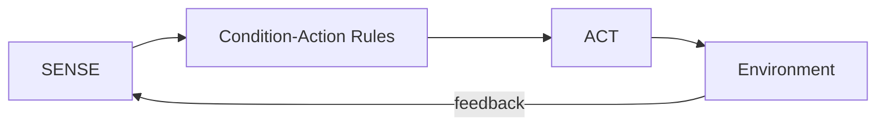
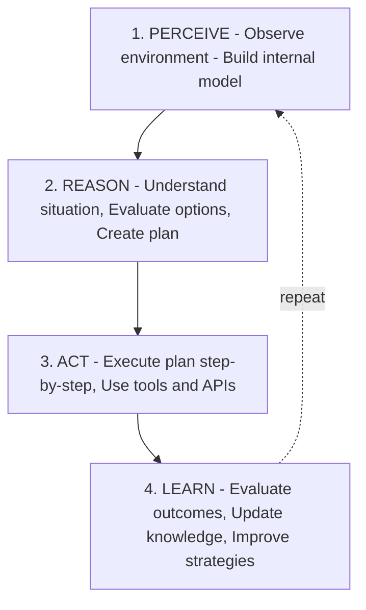

# Types of Agent Architectures

## 1. Reactive Architectures (Sense→Act model)

- **simplest form of agent design**.
- operates on a direct **Sense → Act** loop with **no reasoning, planning, or memory** - so agent responds immediately! Uses predefined tools. This structure is inspired by classical robotics and early AI systems.
- Reactive agents are focused on the speed, efficiency, and direct response to the enviroment.


Key Characteristics:

- ❌ No internal state
- ❌ No memory of past actions
- ❌ No planning or reasoning or multi-step reasoning
- ❌ Inflexible - difficult to adapt for new or uncertain scenarios
- ❌ No learning
- ❌ Not suitable for open-ended or high variability tasks
- ✅ Immediate stimulus-response
- ✅ Simple condition-action rules
- ✅ Very fast execution
- ✅ Predictable behavior

### Comparison: Reactive vs. Deliberative

| Feature | Reactive (Sense→Act) | Deliberative (Perceive→Reason→Act→Learn) |
| --- | --- | --- |
| **Memory** | None | Short-term & Long-term |
| **Planning** | None | Yes, multi-step |
| **Reasoning** | None | Complex LLM-based |
| **Speed** | *Very fast (ms)* | Slower (seconds) |
| **Complexity** | Simple rules | Complex reasoning |
| **Adaptability** | Fixed rules | Learns and adapts |
| **Use Case** | Simple, fast responses | Complex problems |
| **Example** | Thermostat | Research assistant |

### When to Use Reactive Architectures

#### Good Use Cases

1. **Real-time systems requiring fast responses** - Industrial control, robot obstacle avoidance, emergency shut-off
2. **Simple, well-defined problems** - Thermostats, automatic doors, traffic lights, vending machines
3. **Predictable environments** - Manufacturing lines, simple games (Pac-Man ghosts)
4. **When simplicity is crucial** - Embedded systems, low-power devices, safety-critical systems
5. **First responders** - Fire alarms, airbag deployment, anti-lock brakes

#### Bad Use Cases

1. **Complex problem-solving** - Research tasks, strategic planning, creative work
2. **Tasks requiring memory** - Conversations, multi-step workflows, learning from experience
3. **Ambiguous situations** - Natural language understanding, context-dependent decisions
4. **Unpredictable environments** - Open-world scenarios, human interaction, novel situations

#### Advantages

1. **Speed**: Millisecond response times
2. **Simplicity**: Easy to understand and debug
3. **Predictability**: Always behaves the same way
4. **Reliability**: Fewer failure modes
5. **Efficiency**: Low computational requirements
6. **Real-time**: Suitable for hard real-time constraints
7. **Testability**: Easy to test all scenarios

#### Disadvantages

1. **No learning**: Can't improve from experience
2. **No planning**: Can't think ahead
3. **No adaptation**: Fixed behavior
4. **Limited intelligence**: Can't handle complex problems
5. **Brittle**: Fails in unexpected situations
6. **Scalability**: Hard to add new behaviors without conflicts
7. **No memory**: Repeats mistakes


### Key Takeaways for NVIDIA Certification

1. **Reactive = Sense→Act** (no Perceive→Reason→Act→Learn)
2. **Characteristics:** Fast and simple, no internal state, rule-based, limited to simple tasks
3. **When to use:** Real-time requirements, simple predictable environments, safety-critical systems, embedded systems
4. **Limitations:** No learning, no planning, can't handle complexity, brittle in novel situations
5. **Modern Usage:** Often combined with deliberative layers, used for reflexes/emergency responses, foundation for more complex architectures

### Exam-Style Questions

Q1: What's the main difference between reactive and deliberative architectures?
- Reactive: Immediate Sense→Act with no reasoning or memory.
- Deliberative: Perceive→Reason→Act→Learn with planning and memory.

Q2:When would you choose a reactive architecture over a deliberative one?
When you need: (1) Fast response times, (2) Simple predictable environment, (3) Low computational resources, (4) High reliability/safety, (5) Real-time constraints

## 2. Deliberative Architectures (Goal-Based Reasoning)

An agent architecture that uses **internal reasoning, planning, and memory** to achieve goals through a deliberate decision-making process.

 The Deliberative Cycle



**User Query:** "What's the weather in San Francisco and should I bring an umbrella?"

```
Thought 1: I need to find the current weather in San Francisco to answer this question.

Action 1: search_weather(location="San Francisco")

Observation 1: {
  "temperature": "18C",
  "conditions": "Cloudy",
  "precipitation_chance": "75%",
  "forecast": "Rain expected in 2 hours"
}

Thought 2: The weather shows 75% chance of precipitation and rain is expected soon.
This means the user should definitely bring an umbrella. I now have enough information
to provide a complete answer.

Action 2: final_answer()

Answer: The weather in San Francisco is currently 18C and cloudy. There's a 75%
chance of precipitation with rain expected in 2 hours, so yes, you should definitely
bring an umbrella.
```
Key Characteristics

- Interleaved thinking and acting - doesn't plan everything upfront
- Observes results before next step - adapts based on what happens
- Explicit reasoning traces - shows its thought process
- Tool-aware - knows when to use external tools
- Self-correcting - can adjust plan based on observations

## 3. Hybrid Architectures (Fast response + Deep Planning)

- They deliver quick responses for simple tasks and deep reasoning for complex ones. Example: a customer-support agent that instantly greets the user (reactive) but uses an LLM to reason about complaint categories (deliberative)
- This blended approach mirrors how advanced agentic systems behave in real-world environments
- Hybrid models offer both efficiency and adaptability across multiple task types
- Hybrid systems adapt their behaviour based on context, cost and complexity
- They provide the best balance between latency, accuracy and flexibility
- Essential for enterprise agents that must remain reliable while handling diverse requests
- Blend the two flows (reactive and deep) into unified agent pipeline
- Frameworks like LangGraph allow agents to switch dynamically between reactive and reasoning-based models

### Components

1. **Reactive layer** - handles low-latency tasks, rules and direct mapping
2. **Deliberative Layer** - performs planning, analysis and decomposition of goals

---

## 4. Learning Architecture
- Adds a feedback loop that updates behaviour based on data
- Key idea: **Sense→Act→Learn→Improve**
- Example: an adaptive recommender agent retraining its model as user preferences evolve
- Tools: **Reinforcement Learning, RAG, feedback, human-in-the-loop**
- LangGraph Context: integration with retraining or evaluation nodes

## 5. Multi-Agent (Distributed Architecture)
- Multiple specialised agents cooperate to achieve a larger goal
- Key idea: **coordinator-worker** model with shared memory or message passing
- Example: one agent fetches data, another analyzes it, third produces report
- Advantages: parallelism, modularity
- Challenges: synchronization and context sharing

## 6. Tool-Augmented (Extended Mind) Architecture
- Modern Agentic AI extends reasoning through external tools, APIs and databases
- Key idea: LLM or policy network delegates computation or retrieval
- Example: LangChain or NeMo agent calling an LLM, Google Search and a vector store
- This is the **dominant NVIDIA Enterprise Agent design**; know how tool calls are orchestrated
