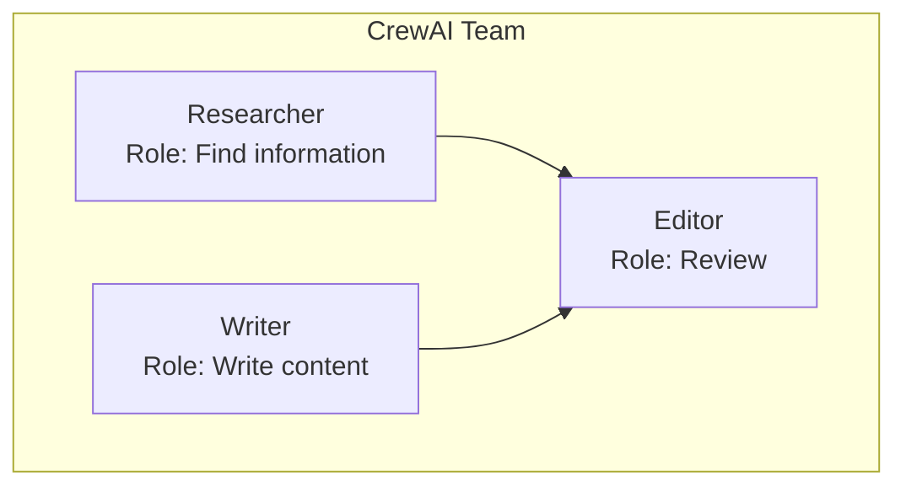

# CrewAI

- **Multi-agent orchestration framework** built specifically for collaborative systems
- Defines **roles** (researcher, writer, analyst), **tasks**, and **delegation patterns**
- Agents work as a "crew" with hierarchical or sequential workflows
- **Built-in coordination mechanisms:**
    - Task handoffs between agents
    - Shared context management
    - Role-based specialization
- "**collaborative planning and execution**" in a **multi-agent system ⇒ think CrewAi**
- CrewAI is designed exactly for this: multiple agents coordinating on complex tasks
- NVIDIA's Agent Intelligence Toolkit integrates with frameworks like CrewAI for team-based agent workflows

## Key Concept: Role-Based Teams

Agents have **roles, goals, and backstories** like a team of specialists.



## Key Components

| Component | Purpose |
| --- | --- |
| **Agent** | Defined by role, goal, backstory |
| **Task** | Specific work assigned to agent |
| **Crew** | Group of agents working together |
| **Process** | Sequential or hierarchical execution |

## Agent Definition

```python
Agent(
    role="Senior Research Analyst",
    goal="Uncover cutting-edge developments in AI",
    backstory="You are a veteran researcher with 20 years experience...",
    tools=[search_tool, scrape_tool]
)
```

## Best For

- Role-based task delegation
- Content creation pipelines
- Research → Analysis → Output workflows
- Teams with clear specializations
