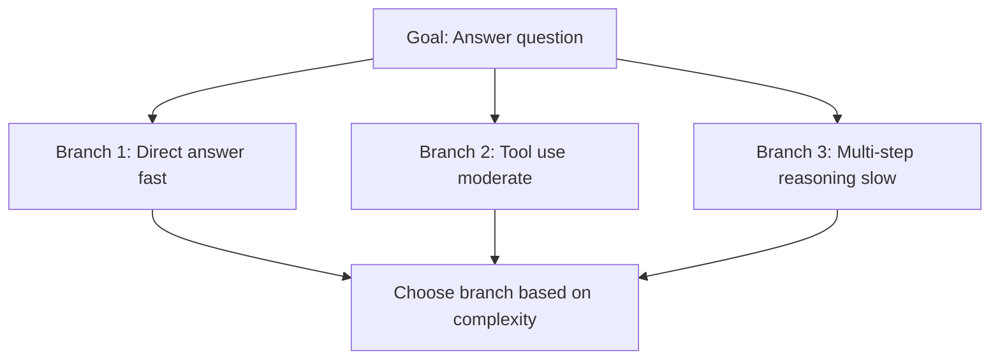
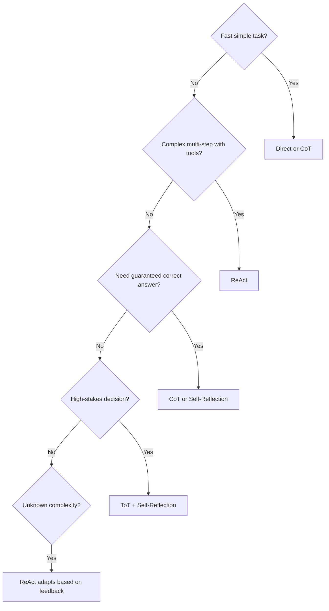
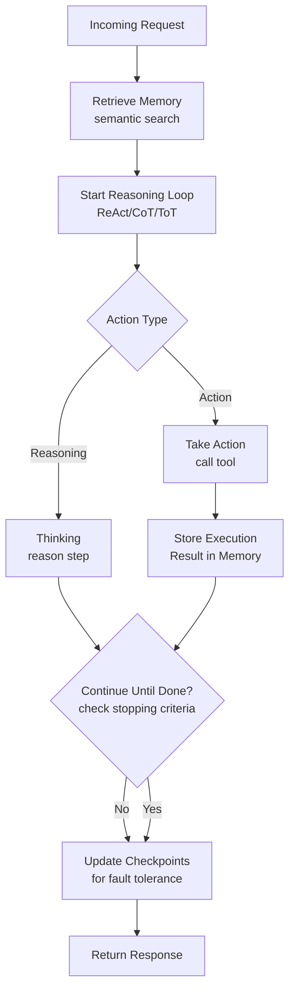
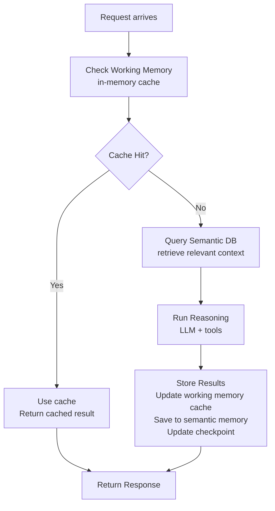

# Memory and Planning in Agentic AI (Domain 5)

## Overview

The cognition layer of an agent processes information, maintains state, plans actions, and learns from interactions. This domain covers how agents think, remember, and make decisions.

---

## Part 1: Memory Architectures

### Memory Types in Production Systems

| Memory Type | Duration | Use Case | Storage |
|---|---|---|---|
| **Context Window** | Single request | Current conversation state | GPU memory |
| **Conversation History** | Session (hours) | Dialogue continuity, multi-turn reasoning | Database |
| **Execution Memory** | Request lifecycle | Intermediate results, chain-of-thought | Checkpoints |
| **Semantic/Long-term** | Persistent | Knowledge retrieval, patterns | Vector DB |
| **Episodic** | Long-term | Past interactions, case memory | Vector DB + metadata |

### Conversation Memory Patterns

#### Single-Turn (Stateless)
```
Request → Agent → Response
(No history)
```
- **Use:** Simple queries, independent tasks
- **Cost:** Low
- **Problem:** Can't reference prior context

#### Multi-Turn with History
```
Request 1 → Agent → Response 1
[Store conversation]
Request 2 (+ full history) → Agent → Response 2
```
- **Use:** Dialogue, follow-up questions
- **Cost:** Grows with conversation length
- **Challenge:** "Lost in the middle" - LLMs miss context in long histories

#### Summarization Pattern
```
Request 1-N → Agent → Response (uses full history)
[Periodically summarize old messages]
Request N+1 → Agent → Response (uses summary + recent messages)
```
- **Use:** Long conversations
- **Cost:** Moderate (summary LLM call cost)
- **Benefit:** Maintains context while controlling tokens

#### Hierarchical Memory
```
Layer 1: Important facts (semantic)
Layer 2: Recent interactions (episodic)
Layer 3: Context window (working memory)

Retrieval: Query Layer 1 & 2, keep Layer 3 fresh
```
- **Use:** Extended reasoning tasks
- **Cost:** Multiple retrievals
- **Benefit:** Best of all approaches

### State Persistence & Checkpointing

From LangGraph documentation, the modern pattern for persistent state:

```python
from langgraph.checkpoint import PostgresSaver
from langgraph.graph import StateGraph

# Define typed state
class AgentState(TypedDict):
    messages: Annotated[list, add_messages]      # Conversation history
    classification: str                           # Agent reasoning state
    tool_calls: list                             # Executed tools
    error_count: int                             # Retry tracking

# Checkpoint saves state automatically after each node
checkpointer = PostgresSaver("postgresql://...")
app = graph.compile(checkpointer=checkpointer)

# Execute with thread_id to enable checkpointing
result = app.invoke(
    state,
    config={"configurable": {"thread_id": "session_123"}}
)

# Resume from checkpoint if interrupted
state_snapshot = app.get_state(
    {"configurable": {"thread_id": "session_123"}}
)
```

**Benefits:**
- ✅ Resume from any checkpoint (fault tolerance)
- ✅ Audit trail of all decisions
- ✅ Human-in-the-loop intervention points
- ✅ Multi-turn workflows with state validation

### Context Window Management

**The Challenge:**
- Modern LLMs have large context windows (8K-100K tokens)
- But each token adds latency and cost
- Need to be strategic about what to include

**Strategies:**

1. **Compression**: Remove unnecessary information
   - Summarize old messages
   - Remove intermediate reasoning
   - Keep only essential facts

2. **Ranking**: Include most relevant information first
   - Recent messages (recency bias)
   - Important facts (semantic similarity)
   - Tools results (immediate relevance)

3. **Dynamic Window**: Adjust based on task
   - Simple question: small window (100 tokens)
   - Complex reasoning: large window (5000 tokens)
   - Decision-making: medium window (2000 tokens)

**Exam pattern:** "How to handle 50-turn conversation?" → Summarization pattern or hierarchical memory

---

## Part 2: Planning Mechanisms

### Goal Decomposition (Planning Layer)

The 4-layer architecture has planning as Layer 2. Decomposition strategies:

#### Linear Decomposition
```
Goal: "Write a quarterly report"
├─ Step 1: Gather financial data
├─ Step 2: Analyze trends
├─ Step 3: Write summary
└─ Step 4: Format for presentation
```
- **Use:** Sequential tasks with clear dependencies
- **Limitation:** Can't adapt if step fails

#### Hierarchical Decomposition
```
Goal: "Optimize inference latency"
├─ Analyze performance
│  ├─ Profile GPU utilization
│  ├─ Check memory bandwidth
│  └─ Measure batch latency
├─ Identify bottleneck
└─ Apply optimization
   ├─ If GPU: use TensorRT-LLM
   ├─ If memory: quantization
   └─ If batch: dynamic batching
```
- **Use:** Complex problems with conditional sub-goals
- **Benefit:** Adaptive to results

#### Flexible Decomposition (Tree Search)

- **Use:** Unknown problem complexity
- **Cost:** Multiple attempts might be needed

### Reasoning Patterns (How Planning Executes)

#### 1. **ReAct Pattern** (Reasoning + Acting)

```
Thought: "I need to check the customer's account history"
Action: call_tool("get_account_history", customer_id=123)
Observation: "Account opened 2020, balance $5000, no issues"
Thought: "Customer is in good standing, can approve"
Final Answer: "Request approved"
```

**When to use:**
- Tool-intensive workflows
- Multi-step tasks requiring tool feedback
- Transparent reasoning needed

**Cost vs Accuracy:** High accuracy, moderate cost (one tool call per thought cycle)

#### 2. **Chain-of-Thought (CoT)**

```
Question: "Is 17 a prime number?"

Let me think through this step by step:
- Prime means only divisible by 1 and itself
- Is 17 divisible by 2? No (17 is odd)
- Is 17 divisible by 3? No (1+7=8, not divisible by 3)
- Is 17 divisible by 5? No (doesn't end in 0 or 5)
- Is 17 divisible by 7? No (17/7 = 2.4...)
- No divisors found up to sqrt(17)
- Therefore, 17 is prime
```

**When to use:**
- Math and logic problems
- Problems needing step-by-step reasoning
- When you want to trace the logic

**Cost vs Accuracy:** High accuracy, low cost (no tool calls), slower

#### 3. **Tree-of-Thoughts (ToT)**

```
Question: "How to optimize both latency AND cost?"

Thought 1a: Use smaller model
  ├─ Faster (good) but less accurate (bad)
  └─ Cheaper (good) but worse quality (bad)

Thought 1b: Use batching
  ├─ Amortizes cost (good)
  └─ Increases latency for individuals (bad)

Thought 1c: Use different models by task
  ├─ Optimize each independently (good)
  └─ Complex to manage (bad)

Evaluate: 1c is best overall
```

**When to use:**
- High-stakes decisions
- Exploring multiple approaches
- Complex optimization problems

**Cost vs Accuracy:** Highest accuracy, highest cost (explores multiple branches)

#### 4. **Self-Reflection**

```
Response: "The customer should be approved"
Critique:
  - Did we check credit score? No ✗
  - Did we verify identity? No ✗
  - Did we check fraud alerts? No ✗
Reflection: "We missed important checks. Let me revise."
Revised Response: "Before approval, need to verify identity and check fraud alerts"
```

**When to use:**
- Quality-critical systems (lending, safety decisions)
- When you have time for iteration
- User-facing applications

**Cost vs Accuracy:** Very high accuracy, high cost (2+ LLM calls)

### Planning Pattern Selection Guide



---

## Part 3: Integrated Cognition in Practice

### The Reasoning + Memory Loop



### State Management Best Practices

1. **Define Clear State Schema**
   ```python
   class AgentState(TypedDict):
       # Messages: accumulate all
       messages: Annotated[list, add_messages]
       # Reasoning: may be overwritten
       current_thought: str
       # Tools: accumulate all calls
       tool_calls: list
       # Decisions: may be changed
       final_decision: str
   ```

2. **Checkpoint Strategically**
   - After each tool call (fault recovery)
   - After each major decision (audit trail)
   - Before long-running operations (resume point)

3. **Clean Up State**
   - Remove old intermediate results
   - Summarize old conversations
   - Archive long-term learning separately

---

## Part 4: Production Cognition System

### Scalable Memory Architecture



### Memory Trade-offs

| Approach | Latency | Cost | Quality | Complexity |
|---|---|---|---|---|
| Context only | Low | Lowest | Low (no memory) | Very Low |
| + Conversation history | Medium | Low | Medium | Low |
| + Semantic retrieval | Medium | Medium | High | Medium |
| + Summarization | Medium-High | Medium | High | High |
| + Hierarchical | High | High | Very High | Very High |

**Production choice:** Usually 3-4 (Semantic + Summarization)

---

## Exam-Focused Summary

**Domain 5 tests:**
- ✅ Memory types and when to use each
- ✅ State persistence and checkpointing
- ✅ Reasoning pattern selection (ReAct, CoT, ToT)
- ✅ Goal decomposition and planning
- ✅ Context window management
- ✅ Integrating memory with reasoning

**Key exam patterns:**
- "How to handle 100-turn conversation?" → Summarization + recent history
- "Agent needs to verify decision?" → Self-Reflection pattern
- "Multi-step task with uncertainty?" → ReAct pattern
- "Memory too large?" → Hierarchical with compression
- "Need to resume after crash?" → Checkpointing strategy

---

## Related Concepts

- **4-Layer Architecture Layer 2** (Cognition): Plans actions
- **Reasoning Patterns** (01-agent-architecture-and-design): Details on ReAct, CoT, ToT
- **LangGraph Checkpointing** (02-agent-development): Technical implementation
- **Knowledge Integration** (06): How memory stores and retrieves knowledge
