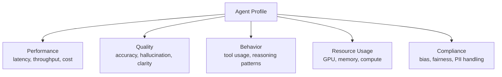
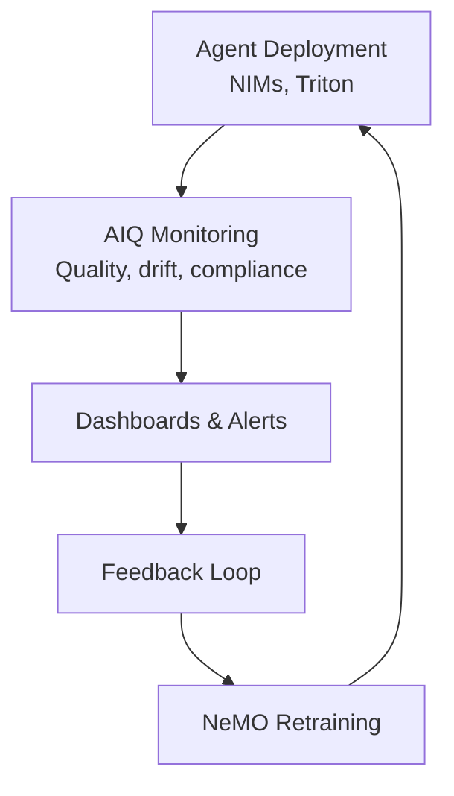

# NVIDIA Agent Intelligence Toolkit (AIQ) (Domain 7)

## Overview

The **NVIDIA Agent Intelligence Toolkit (AIQ)** is a production platform for evaluating, profiling, and monitoring agentic AI systems at scale. It provides observability, debugging, and optimization tools for agents in production.

---

## Part 1: AIQ Fundamentals

### What is AIQ?

**AIQ = Agent Intelligence + Quality monitoring**

**Core capabilities:**
1. **Agent profiling** - Understand agent behavior at scale
2. **Data drift detection** - Monitor for distribution changes
3. **Quality metrics** - Automated evaluation of agent outputs
4. **Explainability** - Understand why agents make decisions
5. **Compliance monitoring** - Track governance requirements
6. **Production dashboards** - Real-time observability

### Why AIQ?

**Problem:** Agents in production can degrade over time

```
Causes of degradation:
- Input distribution changes (concept drift)
- Model behavior changes (label drift)
- Performance regression (versioning issues)
- Quality issues missed by testing
- Compliance violations
```

**Solution:** AIQ continuously monitors and alerts.

---

## Part 2: Agent Profiling

### Profiling Dimensions



### Performance Profiling

```python
from nemo_aiq_toolkit import AgentProfiler

profiler = AgentProfiler(agent=my_agent)

# Profile on test set
profile = profiler.profile(
    test_cases=100,
    concurrent_requests=10
)

# Results:
result = profile.get_metrics()
print(result)
# {
#   "latency": {
#     "p50_ms": 250,
#     "p99_ms": 2340,
#     "mean_ms": 420
#   },
#   "throughput": "42 requests/sec",
#   "cost_per_request": 0.15,
#   "cost_per_successful_request": 0.18,
#   "error_rate": 0.02,
#   "gpu_utilization": 0.85
# }
```

### Quality Profiling

```python
# Evaluate agent output quality
quality_profile = profiler.profile_quality(
    test_cases=100,
    ground_truth=ground_truth_labels
)

# Results:
result = quality_profile.get_metrics()
print(result)
# {
#   "task_success_rate": 0.92,
#   "response_accuracy": 0.89,
#   "hallucination_rate": 0.03,
#   "response_clarity": 0.87,
#   "tool_selection_accuracy": 0.95,
#   "semantic_similarity_to_reference": 0.91
# }
```

### Behavior Profiling

```python
# Understand how agent uses tools
behavior_profile = profiler.profile_behavior(
    test_cases=100
)

result = behavior_profile.get_metrics()
print(result)
# {
#   "tools_per_request": {
#     "mean": 2.3,
#     "max": 8,
#     "distribution": {1: 0.2, 2: 0.5, 3: 0.25, ...}
#   },
#   "reasoning_depth": {
#     "mean_thought_steps": 3.2,
#     "self_correction_rate": 0.15
#   },
#   "tool_usage_distribution": {
#     "search_kb": 0.40,
#     "lookup_customer": 0.35,
#     "create_ticket": 0.20,
#     "other": 0.05
#   }
# }
```

---

## Part 3: Data Drift Detection

### What is Data Drift?

**Data drift** = Distribution of inputs changes over time

```
Example:
Month 1: 90% English, 10% Spanish queries
Month 3: 40% English, 60% Spanish queries

Agent trained on Month 1 distribution
Performance on Spanish queries is poor
Result: Overall accuracy drops
```

### Concept Drift Detection

**Input distribution changes.**

```python
from nemo_aiq_toolkit import ConceptDriftDetector

detector = ConceptDriftDetector(
    reference_set=training_data,
    detection_method="kolmogorov-smirnov",  # Statistical test
    threshold=0.05  # p-value threshold
)

# Monitor production data
for batch in production_batches:
    drift_detected, p_value = detector.check_drift(batch)

    if drift_detected:
        alert("Concept drift detected!")
        # p_value indicates severity
        # Lower = more significant drift

# Results:
# Batch 1: p_value=0.62 (no drift)
# Batch 2: p_value=0.08 (warning)
# Batch 3: p_value=0.002 (alert)
```

### Label Drift Detection

**Output distribution changes (not training target, but model behavior).**

```python
# Detect changes in agent's output patterns
detector = LabelDriftDetector(
    reference_outputs=validation_outputs,
    detection_method="chi-square"
)

# Monitor agent outputs
for batch_outputs in production_outputs:
    drift_detected, metrics = detector.check_drift(batch_outputs)

    if drift_detected:
        print(f"Label drift: {metrics}")
        # {
        #   "detected": True,
        #   "chi_square": 45.3,
        #   "p_value": 0.001,
        #   "changed_classes": ["high_risk", "escalate"]
        # }
```

### Feature Drift Detection

**Specific input features change.**

```python
# Monitor specific features
detector = FeatureDriftDetector(
    reference_set=training_data,
    features_to_monitor=["query_length", "language", "urgency"]
)

for batch in production_data:
    feature_drifts = detector.check_drift(batch)

    # Results:
    # {
    #   "query_length": {"drift": False, "mean": 45},
    #   "language": {"drift": True, "spanish_ratio": 0.65},  # Alert!
    #   "urgency": {"drift": False, "high_pct": 0.20}
    # }
```

### Drift Response Patterns

```python
# Automated response to drift
drift_handler = DriftHandler()

@drift_handler.on_drift_detected
def handle_drift(drift_type, severity):
    if severity == "critical":
        # High-stakes: Escalate to human
        alert_team(f"Critical {drift_type} drift")
        reduce_agent_autonomy()  # Go to manual review mode
    elif severity == "warning":
        # Medium: Log and monitor
        log_metric("drift_warning", drift_type)
        enable_continuous_monitoring()
    else:
        # Low: Just log
        log_metric("drift_info", drift_type)

# The detector calls appropriate handler
detector.add_handler(drift_handler)
```

---

## Part 4: Quality Monitoring

### Automated Quality Metrics

```python
from nemo_aiq_toolkit import QualityMonitor

monitor = QualityMonitor(
    metrics=[
        "hallucination_rate",
        "response_relevance",
        "tool_accuracy",
        "latency_p99",
        "error_rate"
    ],
    alert_thresholds={
        "hallucination_rate": 0.05,     # Alert if > 5%
        "response_relevance": 0.80,     # Alert if < 80%
        "tool_accuracy": 0.90,          # Alert if < 90%
        "latency_p99": 5000,            # Alert if > 5s
        "error_rate": 0.02              # Alert if > 2%
    }
)

# Monitor production
for response in agent_responses:
    quality = monitor.evaluate(response)

    # Automatic alerting
    if quality.violations:
        for violation in quality.violations:
            alert(f"Quality alert: {violation}")

# Dashboard metrics:
dashboard.add_metric(
    "hallucination_rate",
    monitor.get_metric("hallucination_rate"),
    window="24h"
)
```

### Hallucination Detection

```python
# Detect false claims in agent responses
detector = HallucinationDetector(
    knowledge_base=kb,
    method="entailment"  # Use NLI model to verify
)

response = agent.run("What was Q3 revenue?")

# Check against knowledge base
is_hallucination = detector.check(response, knowledge_base_docs)

# Results:
# {
#   "hallucination_detected": False,
#   "confidence": 0.95,
#   "grounded_claims": [
#     "Q3 revenue was $50M"  # ✓ Verified
#   ],
#   "ungrounded_claims": [
#     "Q3 was our best quarter"  # ⚠ Not verified
#   ]
# }
```

---

## Part 5: Compliance Monitoring

### Bias and Fairness

```python
from nemo_aiq_toolkit import FairnessMonitor

monitor = FairnessMonitor(
    protected_attributes=["gender", "age_group", "location"],
    fairness_metrics=["demographic_parity", "equalized_odds", "calibration"]
)

# Evaluate fairness on test set
fairness_report = monitor.evaluate(
    agent_decisions=test_decisions,
    ground_truth=test_truth
)

# Results:
# {
#   "gender": {
#     "demographic_parity": {
#       "male": 0.85,
#       "female": 0.82,
#       "disparity": 0.03  # < 0.10 is acceptable
#     },
#     "equalized_odds": {
#       "male_tpr": 0.92,
#       "female_tpr": 0.89,
#       "difference": 0.03
#     }
#   },
#   "overall_verdict": "PASS"
# }
```

### PII Handling

```python
# Monitor that agent doesn't leak PII
pii_monitor = PIIMonitor(
    patterns=["ssn", "email", "phone", "credit_card", "medical_id"]
)

for response in agent_responses:
    pii_found = pii_monitor.check(response)

    if pii_found:
        alert(f"PII detected: {pii_found}")
        # Log for audit
        log_compliance_violation(response, pii_found)

# Compliance report:
report = pii_monitor.get_report()
# {
#   "total_responses": 10000,
#   "responses_with_pii": 2,  # 0.02%
#   "types_found": ["email", "phone"],
#   "status": "COMPLIANT"
# }
```

### Regulatory Compliance

```python
# GDPR compliance check
gdpr_monitor = GDPRMonitor()

gdpr_monitor.check(
    agent_decisions=[...],
    requirements={
        "explainability": True,          # Must explain decisions
        "user_consent": True,            # Must have consent
        "right_to_deletion": True,       # Support data deletion
        "processing_legitimate": True    # Valid reason for processing
    }
)

# Financial Services compliance (lending)
fsvc_monitor = FinancialServicesMonitor()

fsvc_monitor.check(
    loan_decisions=[...],
    requirements={
        "no_discrimination": True,       # No protected class bias
        "explainability": True,          # Explain why denied
        "audit_trail": True,             # Log all decisions
        "human_override": True           # Humans can override
    }
)
```

---

## Part 6: Production Dashboards

### Key Dashboard Metrics

```
Real-time Monitoring:

Service Health
├── Request volume: 1,250 req/min
├── Success rate: 98.5%
├── Error rate: 1.5%
└── P99 latency: 2,340 ms

Quality Metrics
├── Task success rate: 92%
├── Hallucination rate: 2.3%
├── Tool accuracy: 94%
└── Response clarity: 87%

Compliance Status
├── Bias ratio (M/F): 0.98 (✓ OK)
├── PII incidents: 0 (✓ OK)
├── GDPR violations: 0 (✓ OK)
└── Overall: COMPLIANT

Resource Usage
├── GPU utilization: 85%
├── GPU memory: 72%
├── Cost per request: $0.15
└── Cost trend: Stable
```

### Drift Monitoring Dashboard

```
Data Drift Status:

Concept Drift
├── Detection method: Kolmogorov-Smirnov
├── Last 24h: No drift (p=0.78)
├── Last 7d: Minor drift (p=0.08)
└── Alert: Yellow (monitor)

Feature Drift
├── Query language:
│   ├── English: 45% (baseline 90%) ⚠
│   └── Spanish: 55% (baseline 10%) ⚠
├── Query length:
│   ├── Mean: 42 tokens (baseline 35) ✓
│   └── Stable
└── Urgency:
    ├── High: 30% (baseline 25%) ✓
    └── Stable

Model Performance
├── Accuracy on new dist: 85% (baseline 92%)
├── Regression detected: -7%
└── Recommendation: Retrain or adjust
```

---

## Part 7: Exam-Focused AIQ Patterns

### Common Exam Questions

**Q: "Production agent accuracy dropped 5% overnight. How to diagnose?"**
```
Answer: Use AIQ diagnostics
1. Check concept drift: Is input distribution changed?
2. Check label drift: Is agent output distribution changed?
3. Check quality metrics: Any specific metric dropped?
4. Check error rate: More errors or accuracy reduction?
5. Compare to baseline: When did it start?

Tools:
- ConceptDriftDetector for input analysis
- LabelDriftDetector for output analysis
- QualityMonitor for metric breakdown
```

**Q: "Agent treats 10% of users unfairly (lower approval rate). How to detect?"**
```
Answer: Use AIQ fairness monitoring
1. Identify protected attribute (e.g., gender, age)
2. Monitor demographic parity metric
3. Calculate disparity ratio
4. Alert if ratio > 0.10 (81% rule)

Example:
- Male approval rate: 85%
- Female approval rate: 75%
- Disparity: 75/85 = 0.88 (< 0.81, alert!)
```

**Q: "Compliance audit asks: 'Can you explain agent decisions?' What tool?"**
```
Answer: Use AIQ explainability + compliance monitoring
1. Enable explainability tracking (log all reasoning)
2. Use explainability monitoring
3. Generate audit trail per decision
4. Provide compliance report

AIQ produces:
- Full decision trail for each request
- Explainability metrics
- Compliance report for auditors
```

**Q: "Agent is slow after model update. Performance profiling?"**
```
Answer: Use AIQ profiling
1. Profile old vs new agent on same test set
2. Compare:
   - Latency (p50, p99)
   - Throughput
   - GPU utilization
   - Cost per request
3. Identify bottleneck (reasoning, tool calls, etc)
4. Optimize or rollback
```

---

## Part 8: Integration with Other NVIDIA Tools

### AIQ in the NVIDIA Stack



**Complete lifecycle:**
1. Deploy agent with NIMs
2. AIQ continuously monitors
3. If drift/quality issue detected → Alert
4. Collect data from production
5. Use data to retrain with NeMO
6. Deploy improved version
7. Monitor again

---

## Part 9: Memory Providers for Agents

### AIQ Memory Tracking

```python
# AIQ can track memory usage patterns
memory_monitor = MemoryMonitor(
    memory_types=[
        "conversation",
        "entity",
        "vector_embeddings",
        "execution_trace"
    ]
)

# Monitor memory growth
for request in requests:
    memory_stats = memory_monitor.get_stats()

    # Alert if memory grows unexpectedly
    if memory_stats['total_mb'] > memory_stats['baseline_mb'] * 1.5:
        alert(f"Memory spike: {memory_stats}")
        # Could indicate memory leak
        # Possible causes: unbounded conversation history, etc
```

---

## Related Concepts

- **Agent evaluation** (03-evaluation-and-tuning): Manual vs automated evaluation
- **Monitoring in production** (08-run-monitor-maintain): Infrastructure monitoring
- **Compliance frameworks** (09-safety-ethics-compliance): GDPR, fairness, bias
- **Memory architectures** (05-cognition-planning-memory): Long-term memory management
