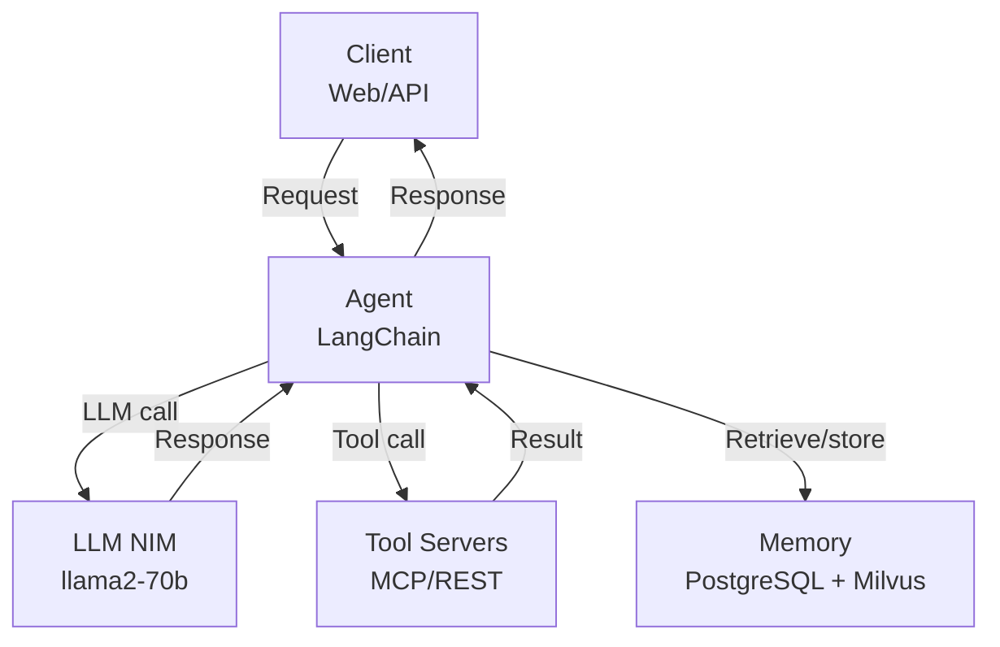
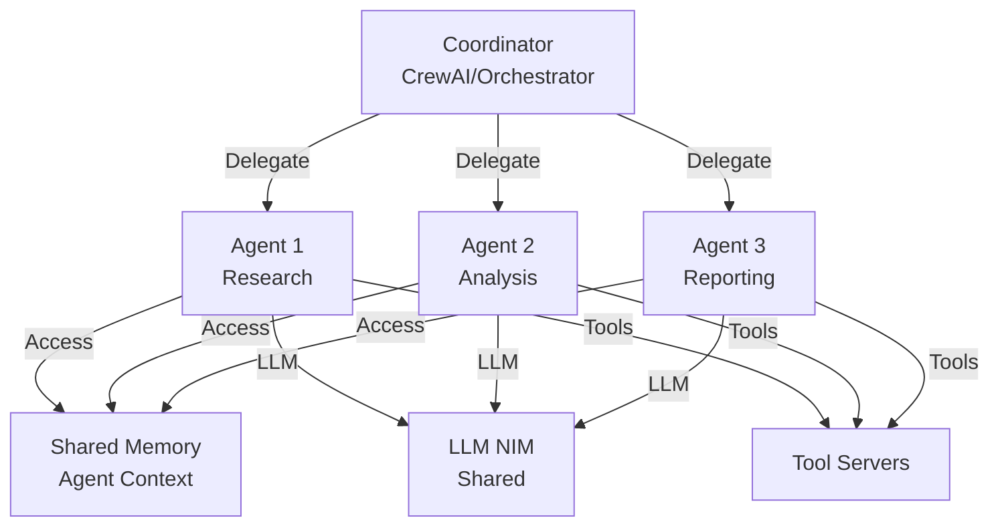
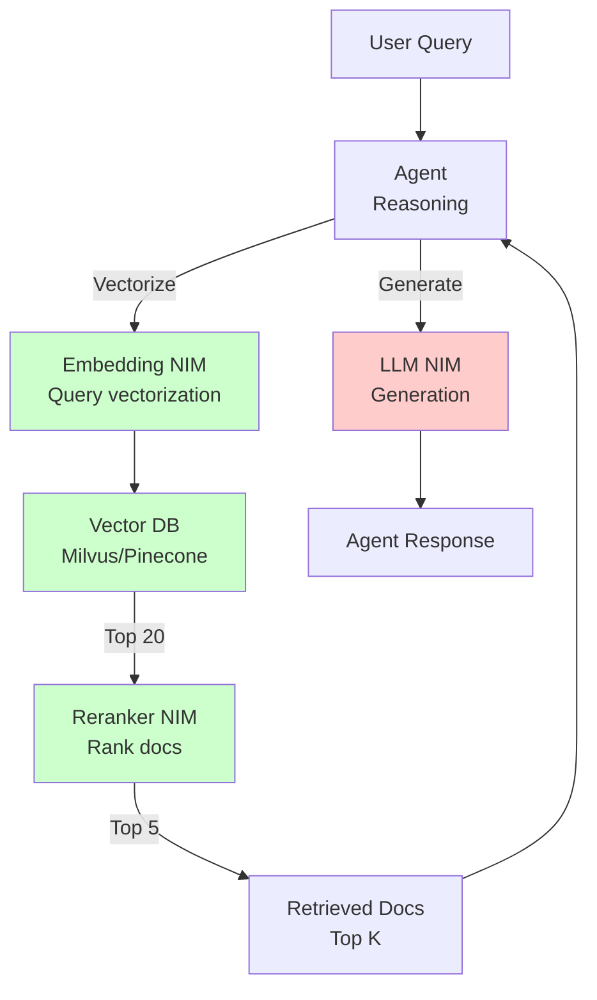
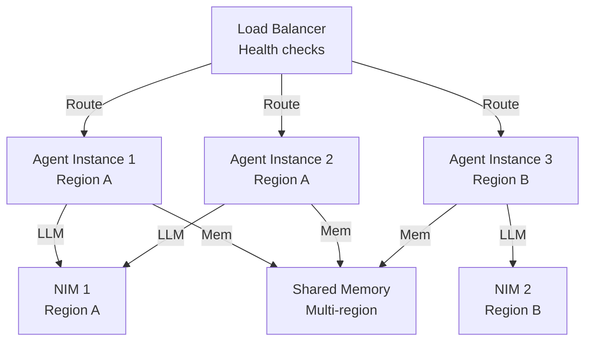
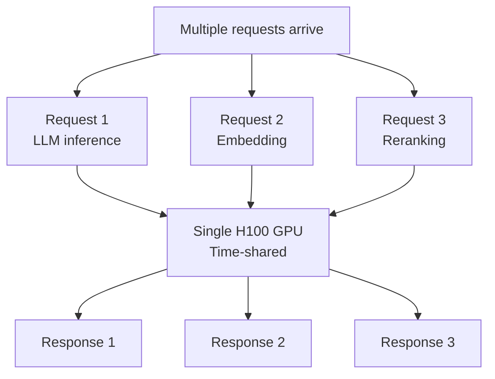

# Agentic AI Architecture Patterns (Domain 7)

## Overview

Production-proven patterns for building scalable, reliable agentic AI systems using NVIDIA components.

---

## Part 1: Single-Agent Architecture

### Basic Pattern



**Use cases:** Single-purpose agents (customer support, document analysis, etc.)

**Scaling:** Horizontal via load balancer when single agent becomes bottleneck

### Configuration

```yaml
# Deployment config
Agent:
  framework: langchain
  llm_endpoint: http://nim:8000/v1
  memory:
    type: postgres
    host: postgres
  tools:
    - customer_lookup
    - ticket_creation

NIM:
  model: llama2-70b-chat
  tensor_parallel_size: 2
  max_batch_size: 32

Monitoring:
  aiqa_enabled: true
  metrics_endpoint: prometheus:9090
```

---

## Part 2: Multi-Agent Coordination Pattern

### Agent Crew Architecture



**Benefits:**
- ✅ Agents specialize (cleaner reasoning)
- ✅ Shared memory avoids redundancy
- ✅ Single NIM serves multiple agents (efficiency)
- ✅ Easy to debug (agent traces)

**Example workflow:**
```
User: "Analyze sales trends and write report"

Coordinator: Delegate to research agent
Research Agent: Query sales data, retrieve trends
  → Updates shared memory with findings

Coordinator: Delegate to analysis agent
Analysis Agent: Reads findings, performs analysis
  → Updates shared memory with analysis

Coordinator: Delegate to reporting agent
Reporting Agent: Reads analysis, generates report
  → Returns report to user
```

---

## Part 3: RAG Agent Architecture

### Production RAG Pattern



**Key decisions:**

1. **Vector search:** Top-K retrieval
   - Trade-off: More results = better recall, worse latency
   - Typical: K=20 for reranking, K=5 for LLM context

2. **Reranking:** Second pass ranking
   - Trade-off: More accurate, adds latency
   - Cost: Small (reranker is tiny model)
   - Benefit: Precision improvement

3. **Context window:** What docs to include
   - Strategy: Top reranked docs + summary of rest
   - Avoids "lost in the middle" problem

### Vector DB Selection

| Provider | Scale | Cost | Speed | Notes |
|----------|-------|------|-------|-------|
| **Milvus** | Large | Low | Medium | Open source, self-managed |
| **Pinecone** | Large | High | Fast | Managed, expensive |
| **Weaviate** | Large | Low | Medium | Open source, GraphQL API |
| **Supabase** | Medium | Low | Medium | PostgreSQL-based, simple |
| **Qdrant** | Large | Low | Fast | Rust-based, high performance |

**Production recommendation:** Milvus (self-managed, free, performant)

---

## Part 4: High-Availability Pattern

### Active-Active Deployment



**Design principles:**
1. **Stateless agents** (no local state)
2. **Shared memory** (distributed DB)
3. **Load balancer** (intelligent routing)
4. **Health checks** (auto-failover)

### Kubernetes Deployment

```yaml
apiVersion: apps/v1
kind: Deployment
metadata:
  name: agent-deployment
spec:
  replicas: 3
  strategy:
    type: RollingUpdate
    rollingUpdate:
      maxUnavailable: 1
      maxSurge: 1

  selector:
    matchLabels:
      app: agent

  template:
    metadata:
      labels:
        app: agent
    spec:
      containers:
      - name: agent
        image: my-registry/agent:latest
        resources:
          requests:
            memory: "4Gi"
            cpu: "2"
          limits:
            memory: "8Gi"
            cpu: "4"
        env:
        - name: NIM_ENDPOINT
          value: "http://nim-service:8000"
        - name: POSTGRES_URL
          valueFrom:
            secretKeyRef:
              name: db-credentials
              key: url
        livenessProbe:
          httpGet:
            path: /health
            port: 8080
          initialDelaySeconds: 30
          periodSeconds: 10
        readinessProbe:
          httpGet:
            path: /ready
            port: 8080
          initialDelaySeconds: 10
          periodSeconds: 5

---
apiVersion: v1
kind: Service
metadata:
  name: agent-service
spec:
  selector:
    app: agent
  ports:
  - protocol: TCP
    port: 80
    targetPort: 8080
  type: LoadBalancer
```

---

## Part 5: Cost-Optimized Pattern

### Tiered Inference

```
Goal: Reduce cost while maintaining quality

Strategy: Use multiple models intelligently

┌─────────────────────────────────────┐
│  Client Request                     │
└──────────────┬──────────────────────┘
               │
        ┌──────▼──────┐
        │ Classifier  │
        │ (fast, cheap)│
        └──────┬──────┘
               │
      ┌────────┴────────┐
      │                 │
   Simple          Complex
   (70%)           (30%)
      │                │
┌─────▼──────┐   ┌────▼─────────┐
│Small model │   │Large model    │
│7B, faster  │   │70B, better    │
│$0.05/req   │   │$0.15/req      │
└────────────┘   └───────────────┘
```

**Economics:**
```
Without tiering:
- Use 70B model for everything
- Cost: 100k req × $0.15 = $15,000/month

With tiering:
- 70% on 7B: 70k × $0.05 = $3,500
- 30% on 70B: 30k × $0.15 = $4,500
- Total: $8,000/month
- Savings: 47% cost reduction
- Quality: 98% of original (worst cases handled by 70B)
```

### GPU Sharing



**Key insight:** Not all model calls are equally expensive.

```
Time budget per request: 100ms

LLM generation: 50ms (expensive)
  ↓ Can batch with other requests

Embedding: 10ms (cheap)
  ↓ Run on idle GPU time

Reranking: 5ms (very cheap)
  ↓ Run on GPU during embedding
```

---

## Part 6: Exam-Focused Architecture Patterns

### Common Exam Scenarios

**Q: "Design agent system for 1M users, <500ms latency requirement"**
```
Answer: Active-Active with tiering

1. Architecture:
   - 3+ agent replicas (geo-distributed)
   - Load balancer with smart routing
   - Shared PostgreSQL + Milvus
   - Multiple NIMs for redundancy

2. Optimization:
   - Embedding: Cache or async
   - LLM: Tiered (7B/70B) by complexity
   - Response streaming (don't wait for full)
   - Connection pooling

3. Monitoring:
   - P99 latency < 500ms (critical)
   - Error rate < 0.1%
   - Cost per request target

Result: Highly available, cost-efficient, meets SLA
```

**Q: "Agent training loop: collect feedback, retrain, deploy. Pattern?"**
```
Answer: Continuous improvement loop

1. Deploy agent with AIQ monitoring
2. Collect production data + user feedback
3. Evaluate quality degradation
4. If drift detected:
   a. Gather retraining data
   b. Use NeMO Curator to clean
   c. Fine-tune model (LoRA for speed)
   d. Evaluate on test set
   e. A/B test vs current
   f. Deploy if improved
5. Update model in NIM
6. Monitor for regression

Cadence: Weekly retraining
Timeline: 2-3 days from collection to production
```

**Q: "Budget is $5k/month for production agent. What to do?"**
```
Answer: Cost-optimized architecture

1. Infrastructure:
   - Single L40S GPU: $500/month
   - PostgreSQL managed: $100/month
   - Milvus self-managed: $200/month
   - Monitoring: $100/month
   Total infrastructure: $900/month

2. Software:
   - TensorRT-LLM (free)
   - NeMO Agent Toolkit: Consider or skip
   - AIQ (consider lite version)
   - Open-source agents (LangChain)
   Total software: $500-1000/month (optional)

3. Capacity:
   - 50-100 requests/day = ~1000 users
   - Small but functional

4. Optimization:
   - Use smaller model (7B vs 70B)
   - Aggressive caching
   - Batch inference
   - No fancy monitoring

Result: Working agent system for $5k/month, but tight margins
```

---

## Part 7: Anti-Patterns to Avoid

### Anti-Pattern 1: Stateful Agents

❌ **Don't do:**
```python
# Agent keeps state in memory
class AgentInstance:
    def __init__(self):
        self.conversation_history = []  # BUG: Not shared across replicas
        self.entity_cache = {}

    def run(self, request):
        self.conversation_history.append(request)  # Only on this instance!
        ...
```

✅ **Do:**
```python
# State in shared DB
agent.memory_provider.store(
    thread_id=request.session_id,
    conversation=new_turn
)
```

**Why:** Horizontal scaling breaks if state is local.

### Anti-Pattern 2: Synchronous Inference for High Latency

❌ **Don't do:**
```python
# Wait for 70B model response (might be 30 seconds)
response = llm.generate(prompt)  # Blocks!
return response
```

✅ **Do:**
```python
# Stream response back to client
for token in llm.generate_stream(prompt):
    yield token  # Send incrementally
```

**Why:** User sees response incrementally vs "loading" for 30s.

### Anti-Pattern 3: Single Point of Failure

❌ **Don't do:**
```
Client → Single Agent Instance → Single GPU
```
If agent or GPU fails = down for all users.

✅ **Do:**
```
Client → Load Balancer → Multiple Agents → Multiple GPUs
```

---

## Part 8: Migration from Simple to Production

### Phase 1: Prototype (1 week)

```
Setup:
- Single GPU machine
- LangChain agent
- Single NIM (or open-source)
- SQLite for memory
- Manual testing

Deployed to: Single machine
Users: Development team
Uptime: Best effort
```

### Phase 2: Pilot (2 weeks)

```
Setup:
- Managed GPU (e.g., Lambda Labs)
- LangChain + NeMo Agent Toolkit
- NIM with dynamic batching
- PostgreSQL for memory
- Basic monitoring

Deployed to: Production environment
Users: Limited (100s)
Uptime: 95%
```

### Phase 3: Production (1 month)

```
Setup:
- Multi-GPU cluster
- NeMo Agent Toolkit + AIQ
- Multiple NIMs for HA
- PostgreSQL + Milvus
- Full monitoring + alerting
- A/B testing framework

Deployed to: Multiple regions
Users: Scaled (1000s+)
Uptime: 99.5%+
```

---

## Related Concepts

- **Deployment scaling** (04-deployment-and-scaling): Infrastructure patterns
- **Agent frameworks** (02-agent-development): Framework selection
- **Production monitoring** (08-run-monitor-maintain): Observability
- **Error handling** (01-agent-architecture-and-design): Reliability
