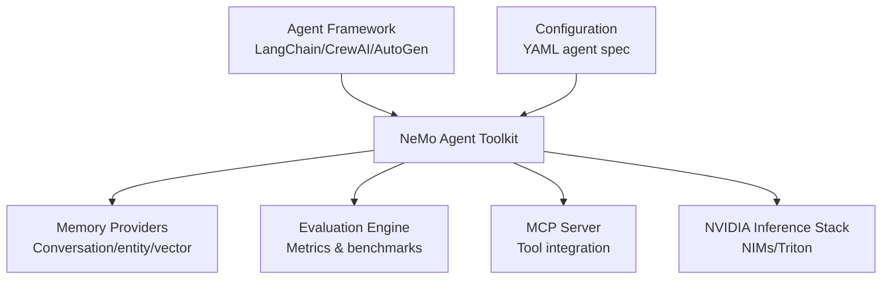
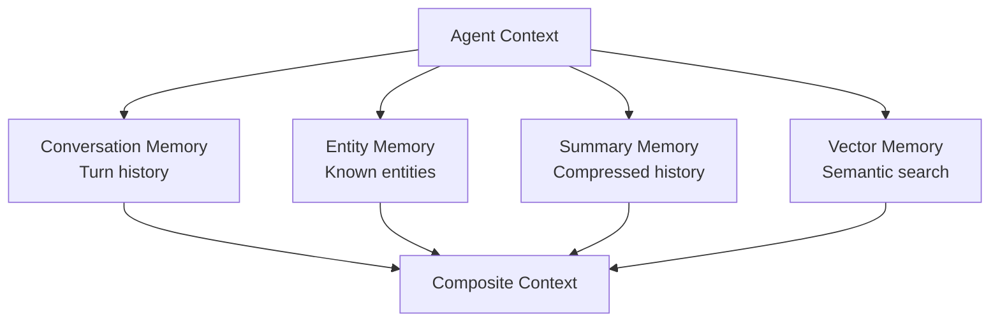
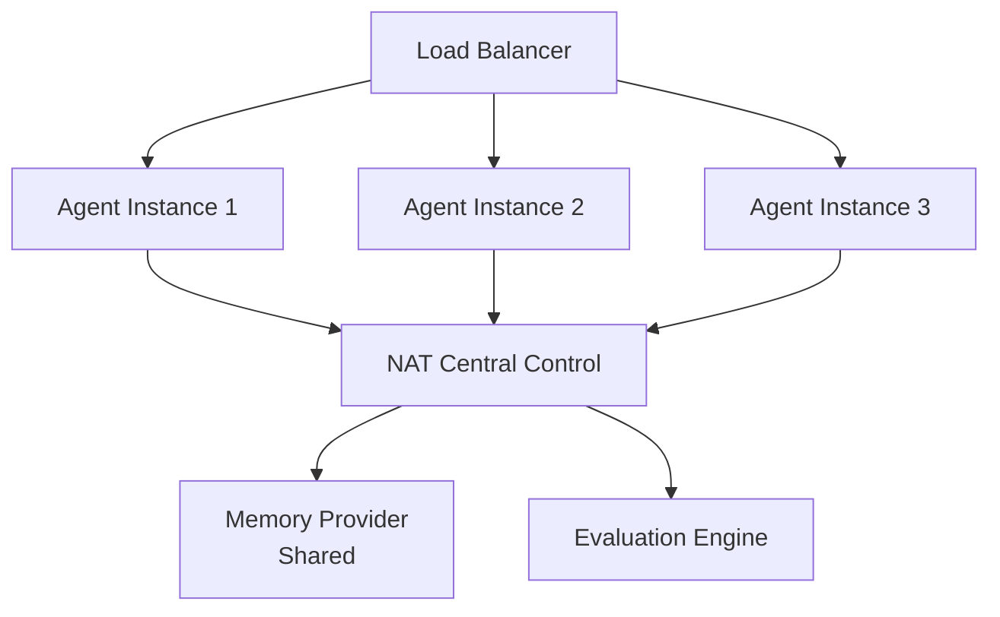
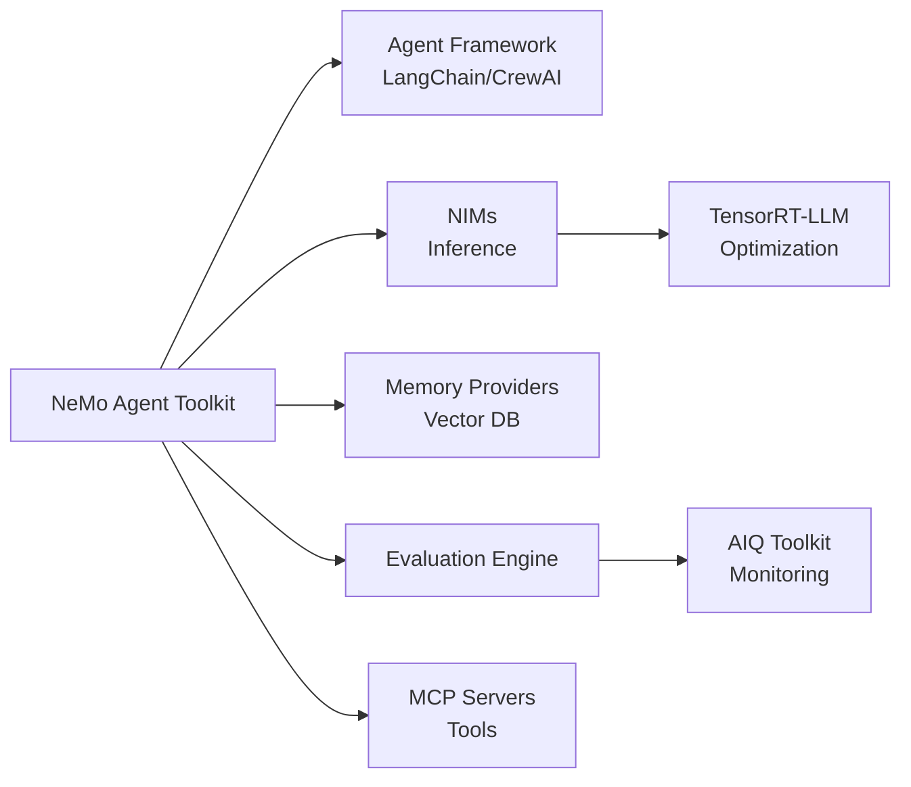

# NVIDIA NeMo Agent Toolkit (Domain 7)

## Overview

The **NeMo Agent Toolkit (NAT)** is a framework-agnostic platform for building, evaluating, and deploying production-ready AI agents. It sits between your agent framework (LangChain, CrewAI, etc.) and NVIDIA's inference infrastructure (NIMs, Triton).

---

## Part 1: NAT Fundamentals

### What is the NeMo Agent Toolkit?

**Core purpose:** Unified agent development and operations platform

**Key responsibilities:**
1. **Framework abstraction** - Works with any agent framework
2. **Unified configuration** - YAML-based agent definition
3. **Evaluation tools** - Benchmark agent performance
4. **Memory management** - Structured memory providers
5. **Monitoring & debugging** - Production observability
6. **MCP support** - Model Context Protocol integration

### Why NAT Instead of Framework-Specific Tools?

| Aspect | Framework-Specific | NAT |
|--------|-------------------|-----|
| **Lock-in** | Tied to one framework | Works with any framework |
| **Configuration** | Scattered in code | Centralized YAML |
| **Evaluation** | Ad-hoc, manual | Systematic, automated |
| **Memory** | DIY implementations | Built-in memory providers |
| **Monitoring** | Roll your own | Integrated dashboards |

**Best for:** Production systems that need flexibility + observability.

---

## Part 2: NAT Architecture

### High-Level Design



**Data flow:**
1. Agent framework sends requests to NAT
2. NAT retrieves context from memory providers
3. NAT adds tools via MCP
4. Agent reasoning loop (in framework)
5. NAT logs traces and evaluates
6. Results fed back to inference stack

### Framework Integration Points

```python
# Initialize NAT with any framework
from nemo_agent_toolkit import NeMoAgentPlatform
from langchain.agents import initialize_agent

# Configure NAT
nat_config = {
    "framework": "langchain",
    "memory_providers": ["conversation", "entity"],
    "evaluation_enabled": True,
    "mcp_enabled": True
}

platform = NeMoAgentPlatform(nat_config)

# Create agent (standard LangChain)
agent = initialize_agent(tools, llm, agent=AgentType.OPENAI_FUNCTIONS)

# Wrap with NAT monitoring
monitored_agent = platform.wrap(agent)

# Use as normal
result = monitored_agent.run("Do something")
```

---

## Part 3: NAT Configuration

### YAML-Based Agent Definition

```yaml
# agent.yaml - Complete NAT configuration
name: "customer-support-agent"
version: "1.0"

model:
  type: "llm"
  provider: "nims"
  endpoint: "http://localhost:8000"
  model_id: "meta-llama-2-70b-chat"
  generation_config:
    max_tokens: 512
    temperature: 0.7
    top_p: 0.9

memory:
  providers:
    - type: "conversation"
      config:
        max_turns: 20
        summarize_after: 10
    - type: "entity"
      config:
        entities: ["customer", "issue", "resolution"]
    - type: "vector"
      config:
        embedding_model: "nv-embed-v2"
        vector_db: "milvus"
        similarity_threshold: 0.7

tools:
  - name: "lookup_customer"
    mcp_server: "customer_service"
  - name: "create_ticket"
    mcp_server: "ticketing_system"
  - name: "search_kb"
    mcp_server: "knowledge_base"

evaluation:
  enabled: true
  metrics:
    - "task_success_rate"
    - "response_quality"
    - "latency_p99"
  ground_truth_path: "./test_cases.jsonl"

monitoring:
  enabled: true
  dashboard: true
  alert_threshold:
    error_rate: 0.05
    latency_p99: 5000  # ms
```

**Benefits of YAML:**
- ✅ Non-engineers can modify configuration
- ✅ Version control friendly
- ✅ Easy to switch between agents
- ✅ Reproducible deployments

---

## Part 4: Memory Providers

### Memory Types in NAT



### Conversation Memory

**Stores recent interactions in order.**

```python
memory_config = {
    "type": "conversation",
    "max_messages": 50,
    "summarize_after": 20,
    "window_strategy": "recent"  # Keep last 20 msgs
}

# Usage in agent
# Automatically maintains conversation history
# Provides context to LLM

# Result:
# Memory = [
#   {"role": "user", "content": "..."},
#   {"role": "assistant", "content": "..."},
#   ...
# ]
```

### Entity Memory

**Extracts and maintains important entities.**

```python
memory_config = {
    "type": "entity",
    "entities": {
        "customer": {
            "fields": ["name", "account_id", "tier"],
            "extraction_prompt": "Extract customer info..."
        },
        "issue": {
            "fields": ["category", "severity", "status"],
            "extraction_prompt": "Extract issue details..."
        }
    }
}

# Usage:
# Memory automatically extracts entities from conversation
# Provides structured facts to agent

# Result:
# Memory = {
#   "customer": {"name": "John", "account_id": "123", "tier": "gold"},
#   "issue": {"category": "billing", "severity": "high", "status": "open"}
# }
```

### Vector Memory

**Semantic search over past interactions.**

```python
memory_config = {
    "type": "vector",
    "embedding_model": "nv-embed-v2",
    "vector_db": "milvus",
    "collection_name": "agent_memory",
    "chunk_size": 256,
    "similarity_threshold": 0.7
}

# Usage:
# Convert each interaction to embedding
# Store in vector DB
# Retrieve similar past interactions

# Example:
query = "Customer billing issue"
similar = memory.search(query, top_k=3)
# Returns 3 most similar past interactions
# Agent uses for context
```

### Combined Memory Strategy

```python
# Production setup: All three
memory_config = [
    {
        "type": "conversation",
        "max_messages": 10  # Recent context
    },
    {
        "type": "entity",
        "entities": ["customer", "order", "issue"]  # Structured facts
    },
    {
        "type": "vector",
        "collection": "agent_interactions"  # Similar past cases
    }
]

# Result: Agent gets:
# 1. Recent conversation (for continuity)
# 2. Key entities (for structured reasoning)
# 3. Similar examples (for pattern matching)
```

---

## Part 5: Evaluation in NAT

### Built-in Evaluation Metrics

```python
from nemo_agent_toolkit import Evaluator

evaluator = Evaluator(
    metrics=[
        "task_success_rate",     # % tasks completed correctly
        "response_quality",      # BLEU, ROUGE, custom
        "latency_p99",          # Percentile latency
        "tool_accuracy",        # % correct tool selection
        "hallucination_rate",   # % false claims
        "cost_per_task"         # Compute + API cost
    ]
)

# Evaluate against test set
results = evaluator.evaluate(
    agent=my_agent,
    test_set="test_cases.jsonl",
    num_samples=100
)

# Results:
# {
#   "task_success_rate": 0.92,
#   "response_quality": 0.88,
#   "latency_p99_ms": 2340,
#   "tool_accuracy": 0.95,
#   "hallucination_rate": 0.02,
#   "cost_per_task": 0.15
# }
```

### Custom Evaluation

```python
class DomainSpecificEvaluator:
    def evaluate(self, response, ground_truth):
        # Your custom logic
        return {
            "domain_accuracy": ...,
            "regulatory_compliance": ...,
            "user_satisfaction": ...
        }

evaluator.add_custom_metric(DomainSpecificEvaluator())
```

---

## Part 6: MCP Integration

### What is MCP?

**Model Context Protocol** - Standard for agent tool integration.

**Benefits:**
- ✅ Language-agnostic tool definition
- ✅ One server supports multiple agents
- ✅ Built-in transport (stdio, SSE)
- ✅ Resource discovery

### MCP Server Definition

```yaml
# tools_server.yaml - MCP server configuration
name: "customer-service-tools"
version: "1.0"

tools:
  - name: "lookup_customer"
    description: "Look up customer by ID or email"
    input_schema:
      type: "object"
      properties:
        customer_id:
          type: "string"
          description: "Customer ID"
        email:
          type: "string"
          description: "Customer email"
      required: ["customer_id"]

  - name: "create_support_ticket"
    description: "Create a support ticket for customer"
    input_schema:
      type: "object"
      properties:
        customer_id:
          type: "string"
        issue_category:
          type: "string"
          enum: ["billing", "technical", "account"]
        description:
          type: "string"
      required: ["customer_id", "issue_category", "description"]

resources:
  - uri: "kb://articles"
    name: "knowledge-base"
    description: "Internal knowledge base articles"
```

### MCP Usage in Agent

```python
from nemo_agent_toolkit import MCPManager

# Initialize MCP
mcp = MCPManager()
mcp.add_server(
    name="customer_service",
    command="python tools_server.py"
)

# Tools automatically available to agent
# Agent calls like: lookup_customer(customer_id="123")
# MCP handles transport and serialization
```

---

## Part 7: Production Deployment with NAT

### Multi-Agent System



### Docker Deployment

```dockerfile
# Dockerfile for NAT-based agent
FROM nvidia/cuda:12.0-runtime-ubuntu22.04

# Install dependencies
RUN pip install nemo-agent-toolkit langchain nvidia-nim

# Copy agent config
COPY agent.yaml /app/agent.yaml
COPY tools_server.py /app/tools_server.py

# Run agent
WORKDIR /app
CMD ["nemo-agent", "serve", "--config", "agent.yaml"]
```

**Docker compose:**
```yaml
version: "3.9"
services:
  agent:
    build: .
    ports: ["8080:8080"]
    environment:
      NIM_ENDPOINT: "http://nim:8000"
      MILVUS_HOST: "milvus"
    depends_on:
      - nim
      - milvus

  nim:
    image: nvcr.io/nim/meta-llama/llama2-70b:latest
    gpus: ["all"]
    ports: ["8000:8000"]

  milvus:
    image: milvusdb/milvus:latest
    ports: ["19530:19530"]
    volumes:
      - milvus_data:/var/lib/milvus

volumes:
  milvus_data:
```

---

## Part 8: Exam-Focused NAT Patterns

### Common Exam Questions

**Q: "Agent needs custom memory across conversations. Which NAT feature?"**
```
Answer: Entity Memory + Vector Memory
1. Entity Memory extracts key facts automatically
2. Vector Memory stores past interactions semantically
3. On each request: retrieve relevant past interactions
4. Agent uses for context

Example: Support agent remembers customer's past issues
```

**Q: "Deploying agent across 3 replicas. How to keep memory consistent?"**
```
Answer: Use shared memory providers
- Conversation: Centralized DB (PostgreSQL)
- Entity: Centralized KB (Milvus)
- Vector: Centralized vector DB

NAT automatically synchronizes across instances
```

**Q: "Agent performance degraded in production. What to do?"**
```
Answer: Use NAT Evaluation Engine
1. Enable continuous evaluation
2. Compare metrics to baseline
3. Identify regression area
4. Update agent config
5. A/B test new vs old

NAT provides dashboard with all metrics
```

**Q: "Need to add new tool without stopping agent?"**
```
Answer: MCP server pattern
1. Implement new MCP server
2. Update agent config YAML
3. Restart MCP connection (no agent restart)
4. Tool available immediately

This is why MCP + NAT matters: modularity
```

---

## Part 9: NAT vs Framework-Native Tools

### Comparison

| Feature | LangChain Tools | CrewAI Tools | NAT |
|---------|---|---|---|
| **Framework-agnostic** | No | No | Yes |
| **YAML config** | No | Yes | Yes |
| **Memory providers** | Basic | Basic | Advanced |
| **Evaluation built-in** | No | Limited | Yes |
| **MCP support** | No | No | Yes |
| **Production monitoring** | No | No | Yes |

**When to use NAT:**
- ✅ Multi-framework environments
- ✅ Production with observability needs
- ✅ Complex memory requirements
- ✅ Multiple agents sharing infrastructure

---

## Part 10: Integration with Other NVIDIA Tools

### NAT Ecosystem



---

## Related Concepts

- **Agent frameworks** (02-agent-development): LangChain, CrewAI
- **NIMs** (07-nvidia-platform): Inference endpoints
- **MCP** (07-nvidia-platform): Tool integration protocol
- **AIQ Toolkit** (07-nvidia-platform): Production monitoring
- **Memory architectures** (05-cognition-planning-memory): NAT memory strategies
