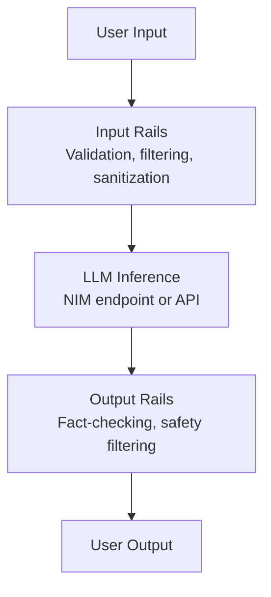
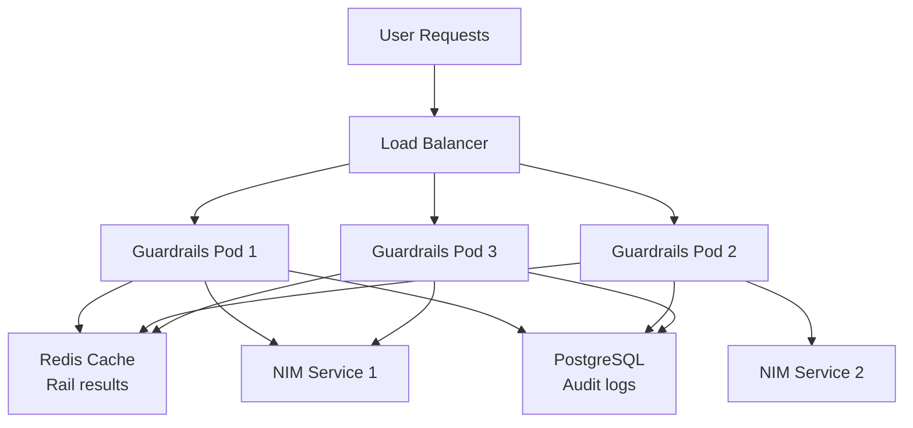

# NVIDIA NeMo Guardrails

## Overview

**NeMo Guardrails** is NVIDIA's framework for adding compliance, safety, and behavior control to LLM-based applications. It runs alongside your LLM (NIM, open-source model, or closed API) and intercepts input/output to enforce rules without modifying the base model or incurring fine-tuning costs.

**Key insight:** Guardrails are a **middleware safety layer**, not a model modification. They work with any LLM endpoint.

---

## Part 1: What Are Guardrails and Why They Matter

### The Problem

LLMs are powerful but unpredictable:

- Hallucinate facts
- Go off-topic
- Potentially generate unsafe content
- Leak sensitive information
- Bypass instructions in prompts

**Traditional approach:** Fine-tune the model (expensive, risky, permanent).

**Modern approach:** Add guardrails (flexible, auditable, reversible).

### What NeMo Guardrails Solve



**Types of problems guardrails address:**

| Problem                | Solution               | Example                                   |
| ---------------------- | ---------------------- | ----------------------------------------- |
| **Off-topic requests** | Topical rails          | Block discussions outside domain          |
| **Harmful content**    | Safety rails           | Block instructions for illegal activities |
| **Hallucinated facts** | Fact-checking rails    | Verify claims against knowledge base      |
| **Prompt injection**   | Input validation rails | Sanitize user input                       |
| **Data leakage**       | Output filtering rails | Remove PII before returning               |
| **Jailbreak attempts** | Dialog rails           | Maintain conversation boundaries          |

### Why Not Just Fine-Tune?

| Aspect              | Fine-tuning                | Guardrails                           |
| ------------------- | -------------------------- | ------------------------------------ |
| **Cost**            | High (compute, data, time) | Low (config + inference overhead)    |
| **Speed to deploy** | Weeks                      | Days                                 |
| **Reversibility**   | Permanent                  | Easily updated                       |
| **Auditability**    | Model behavior opaque      | Clear rules, explainable             |
| **Flexibility**     | Fixed behavior             | Dynamic, adjustable per user/context |
| **Compliance**      | Hard to verify             | Demonstrable enforcement             |

---

## Part 2: NeMo Guardrails Architecture

### Core Components

```
NeMo Guardrails System
├── Colang Language
│   └── User/bot messages, flows, rules, logic
├── Rails Engine
│   ├── Input Rails (pre-LLM)
│   ├── Output Rails (post-LLM)
│   ├── Dialog Rails (conversation flow)
│   └── Retrieval Rails (RAG context)
├── Runtime Executors
│   ├── LLM-based guardrails (use LLM to judge)
│   ├── Programmable guardrails (code-based rules)
│   └── Hybrid (combination)
└── Integration Layer
    ├── REST API endpoints
    ├── NIM endpoint connectors
    └── LangChain/LangGraph adapters
```

### Colang Language

Colang (Conversation Language) is a domain-specific language for defining guardrail rules and conversation flows.

**Basic structure:**

```colang
# Define user message types
user_message:
  - "what is the weather?"
  - "tell me about [topic]"

# Define bot response patterns
bot_message:
  - "I can help with that."
  - "Unfortunately, I don't have information about [topic]"

# Define flows (conversation logic)
define flow handle_off_topic
  user said something off-topic
  bot refuse politely

# Define rules
define rule no_financial_advice
  user ask about financial decisions
  -> bot refuse

define rule stay_professional
  bot said something unprofessional
  -> block and respond with apology
```

**Why Colang?**

- Human-readable syntax
- Version-controllable (YAML/text files)
- No code compilation needed
- Works with runtime guardrails engine

### Rail Types and Placement

#### 1. Input Rails (Pre-LLM)

**Run before the LLM sees the input.**

Purpose: Clean, validate, and protect the LLM from bad input.

**Examples:**

```colang
# Block input matching certain patterns
define rail input_validation
  user input length > 5000
  -> block with "Input too long"

# Sanitize PII
define rail sanitize_pii
  user input contains email or phone
  -> redact and log

# Language detection
define rail language_check
  user input not in [english, spanish]
  -> block with "Language not supported"
```

**Implementation pattern:**

```python
from nemo_guardrails import RailsConfig, LLMRails
from nemo_guardrails.rails import InputRail

config = RailsConfig.from_path("config")

# Add custom input rail
class ProfanityRail(InputRail):
    def execute(self, user_message):
        if any(word in user_message.lower() for word in BANNED_WORDS):
            return False, "Input contains inappropriate language"
        return True, user_message

rails = LLMRails(config)
rails.add_rail(ProfanityRail())
```

#### 2. Output Rails (Post-LLM)

**Run after the LLM generates output.**

Purpose: Prevent harmful, false, or inappropriate responses from reaching users.

**Examples:**

```colang
# Fact-checking rail
define rail verify_facts
  bot output claims a fact
  -> retrieve from knowledge base
  -> if not verified: block and suggest "I'm not sure about that"

# Safety filtering
define rail filter_harmful_output
  bot output suggests illegal activity
  -> block and respond with "I can't help with that"

# Remove PII
define rail remove_pii_output
  bot output contains personal information
  -> redact before sending to user
```

**LLM-based output rail example:**

```python
from nemo_guardrails import RailsConfig, LLMRails

config = RailsConfig()
config.output_rails = [
    {
        "name": "harmful_content_check",
        "type": "llm_based",
        "prompt": """
You are a safety filter. Check if the bot response is harmful,
illegal, or inappropriate. Respond with SAFE or UNSAFE.

Response: {response}
Your verdict:
        """,
        "actions": {
            "UNSAFE": "block_and_respond"
        }
    }
]
```

#### 3. Dialog Rails (Conversation Flow)

**Manage conversation state and enforce flow constraints.**

Purpose: Keep conversations coherent, enforce turn order, prevent infinite loops.

**Examples:**

```colang
# Enforce greeting before service request
define flow require_greeting
  user message
  if not user.has_greeted:
    -> bot greet
    -> set user.has_greeted = true

# Limit retries
define flow retry_limit
  user ask for clarification
  if user.retry_count > 3:
    -> bot suggest escalation to human

# Maintain context window
define flow manage_context
  if conversation_length > 10_turns:
    -> summarize and archive old messages
```

**Implementation:**

```python
from nemo_guardrails import DialogRail

class GreetingRail(DialogRail):
    def execute(self, conversation_state):
        if not conversation_state.user.greeted:
            return {
                "action": "inject_message",
                "message": "Hello! How can I help?"
            }
        return None
```

#### 4. Retrieval Rails (RAG Integration)

**Control and validate information used from knowledge bases.**

Purpose: Ensure RAG context is relevant, up-to-date, and verified.

**Examples:**

```colang
# Verify retrieval source
define rail check_retrieval_source
  bot about to use retrieved document
  -> verify document is from approved list
  -> if not approved: block and use alternative

# Fact-checking against retrieval
define rail fact_check_with_rag
  bot output references [claim]
  -> retrieve supporting documents
  -> if confidence < 0.8: add disclaimer

# Handle stale information
define rail check_document_freshness
  bot using retrieved document
  -> check document date
  -> if older than 6 months: add update disclaimer
```

---

## Part 3: Implementation Patterns

### Pattern 1: Programmable Guardrails (Simple, Deterministic)

**Use case:** Rules you can hardcode - language checks, length limits, exact pattern matching.

**Advantages:** Fast, no LLM overhead, deterministic.

**Disadvantages:** Can't handle nuanced scenarios.

**Example: Language and length guardrails**

```python
from nemo_guardrails import RailsConfig, LLMRails
from nemo_guardrails.rails import InputRail, OutputRail

# Configuration
config = RailsConfig()

# Custom programmable input rail
class InputValidator(InputRail):
    def execute(self, user_input):
        # Check length
        if len(user_input) > 2000:
            return False, "Input must be under 2000 characters"

        # Check for banned patterns
        banned_patterns = ["DROP TABLE", "DELETE FROM", "--"]
        if any(pattern in user_input.upper() for pattern in banned_patterns):
            return False, "SQL-like syntax not allowed"

        return True, user_input

# Custom output rail
class OutputValidator(OutputRail):
    def execute(self, bot_output):
        # Check for PII
        import re
        pii_pattern = r"\b\d{3}-\d{2}-\d{4}\b"  # SSN pattern
        if re.search(pii_pattern, bot_output):
            bot_output = re.sub(pii_pattern, "[REDACTED]", bot_output)

        return True, bot_output

# Apply rails
rails = LLMRails(config)
rails.add_rail(InputValidator())
rails.add_rail(OutputValidator())

# Use in application
response = rails.generate(
    user_input="What's the capital of France?",
    llm_endpoint="http://localhost:8000/v1/chat/completions"
)
```

### Pattern 2: LLM-Based Guardrails (Nuanced, Flexible)

**Use case:** Rules requiring judgment - is this harmful? Is this fact-checked? Is this professional?

**Advantages:** Handles nuanced scenarios, easily updatable, no code changes needed.

**Disadvantages:** Adds latency (LLM call per rail), costs money.

**Example: Fact-checking and safety filtering**

```python
from nemo_guardrails import RailsConfig, LLMRails

config = RailsConfig()

# LLM-based fact-checking rail
config.output_rails = [
    {
        "name": "fact_check",
        "type": "llm_based",
        "trigger": "bot_output_ready",
        "llm_model": "nemotron-3-8b-chat",
        "llm_endpoint": "http://localhost:8000/v1/chat/completions",
        "prompt": """
You are a fact-checking assistant. Review the bot's response below.

Bot response: {bot_output}

Check if all factual claims are reasonable and not obviously false.
Respond with VERIFIED or UNVERIFIED. If UNVERIFIED, explain why.

Your assessment:
        """,
        "actions": {
            "UNVERIFIED": {
                "action": "modify_response",
                "template": "I'm not entirely certain about that. {bot_output} (Please verify this information independently.)"
            }
        }
    },
    {
        "name": "safety_filter",
        "type": "llm_based",
        "trigger": "bot_output_ready",
        "llm_model": "nemotron-3-8b-chat",
        "prompt": """
Is the following response safe and appropriate?
Response: {bot_output}

Check for:
- Instructions for harmful/illegal activities
- Hate speech or discrimination
- Sexually explicit content
- Violence or threats

Respond with SAFE or UNSAFE. If UNSAFE, explain.

Your verdict:
        """,
        "actions": {
            "UNSAFE": {
                "action": "block_response",
                "fallback": "I can't provide that information."
            }
        }
    }
]

rails = LLMRails(config)
```

### Pattern 3: Hybrid Guardrails (Best of Both)

**Use case:** Combine fast programmable rules with slower LLM-based judgment.

**Strategy:** Use programmable rails first (fast filter), then LLM rails on surviving outputs (cost/latency control).

**Example: Multi-layer safety**

```python
from nemo_guardrails import RailsConfig, LLMRails

config = RailsConfig()

# Layer 1: Fast, deterministic filters
config.input_rails = [
    {
        "name": "sql_injection_block",
        "type": "programmable",
        "patterns": ["DROP TABLE", "DELETE FROM", "UNION SELECT"]
    }
]

# Layer 2: Context-aware LLM judgment (only on inputs that pass layer 1)
config.output_rails = [
    {
        "name": "relevance_check",
        "type": "llm_based",
        "trigger": "after_input_rails",
        "prompt": "Is this query relevant to customer support? RELEVANT or OFF_TOPIC."
    },
    {
        "name": "safety_judge",
        "type": "llm_based",
        "trigger": "after_input_rails",
        "skip_if_input_cost_exceeded": True,  # Skip if input rails used tokens
        "prompt": "Is this safe? SAFE or UNSAFE."
    }
]

rails = LLMRails(config)
```

---

## Part 4: Integration with NIMs and Inference Endpoints

### Connecting to a NIM Endpoint

NeMo Guardrails typically wraps around an inference endpoint (NIM, OpenAI, Anthropic, etc.).

**Architecture:**

```
User Application
    ↓
NeMo Guardrails
├─ Input Rails ↓
├─ LLM Endpoint (NIM)
└─ Output Rails ↓
    ↓
Response to User
```

**Configuration example:**

```yaml
# config.yml
rails:
  - name: "guardrails_config"
    rails:
      input_rails:
        - name: "input_validation"
          type: "programmable"
      output_rails:
        - name: "safety_check"
          type: "llm_based"

llm:
  model_name: "nemotron-3-8b-chat"
  # Option 1: Self-hosted NIM
  endpoint: "http://localhost:8000/v1/chat/completions"
  # Option 2: NVIDIA API endpoint
  # endpoint: "https://api.nvidianemo.com/v1/chat/completions"
  # api_key: "${NVIDIA_API_KEY}"
```

**Python integration:**

```python
from nemo_guardrails import LLMRails, RailsConfig

# Load config from files
config = RailsConfig.from_path("guardrails_config")

# Create rails with explicit endpoint
rails = LLMRails(
    config,
    llm_model="nemotron-3-8b-chat",
    llm_endpoint="http://localhost:8000/v1/chat/completions"
)

# Application code
user_message = "What's the capital of France?"

# Guardrails handle I/O with NIM automatically
response = rails.generate(user_message=user_message)
print(response)
```

### REST API Wrapper

NeMo Guardrails can be deployed as a REST API that sits in front of a NIM:

```python
from fastapi import FastAPI
from nemo_guardrails import LLMRails, RailsConfig

app = FastAPI()
config = RailsConfig.from_path("guardrails_config")
rails = LLMRails(config, llm_endpoint="http://nim-service:8000/v1/chat/completions")

@app.post("/v1/chat/completions")
async def chat_completions(request: dict):
    # Guardrails intercept and validate
    response = await rails.generate_async(
        user_input=request["messages"][-1]["content"]
    )
    return {"choices": [{"message": {"content": response}}]}

# Deploy as container
# docker run -p 8001:8000 -e NIM_ENDPOINT=http://nim:8000 guardrails_api
```

---

## Part 5: Integration with LangChain and LangGraph Agents

### LangChain Integration

NeMo Guardrails can wrap LangChain agents to enforce safety at the boundary.

**Pattern:**

```python
from langchain.agents import AgentType, initialize_agent
from langchain.tools import Tool
from nemo_guardrails import LLMRails, RailsConfig
from langchain.callbacks import BaseCallbackHandler

# Define tools
tools = [
    Tool(
        name="calculator",
        func=lambda x: str(eval(x)),
        description="Useful for math"
    ),
    Tool(
        name="search",
        func=lambda x: f"Results for {x}",
        description="Search the web"
    )
]

# Initialize LangChain agent
agent = initialize_agent(
    tools,
    llm,
    agent=AgentType.ZERO_SHOT_REACT_DESCRIPTION,
    verbose=True
)

# Wrap with guardrails
config = RailsConfig.from_path("guardrails_config")
rails = LLMRails(config, llm_endpoint="http://localhost:8000")

class GuardrailsCallback(BaseCallbackHandler):
    def on_tool_start(self, serialized, input_str, **kwargs):
        # Input guardrails for tool calls
        is_safe, message = rails.check_input(input_str)
        if not is_safe:
            raise ValueError(f"Input blocked: {message}")

    def on_chain_end(self, outputs, **kwargs):
        # Output guardrails for agent responses
        response = outputs.get("output", "")
        is_safe, message = rails.check_output(response)
        if not is_safe:
            raise ValueError(f"Output blocked: {message}")

# Use guarded agent
response = agent.run(
    "What's 2+2?",
    callbacks=[GuardrailsCallback()]
)
```

### LangGraph Integration

For more complex agentic workflows, use NeMo Guardrails as a state validator in LangGraph:

```python
from langgraph.graph import StateGraph, START, END
from nemo_guardrails import LLMRails, RailsConfig
from typing import TypedDict

# Define agent state
class AgentState(TypedDict):
    user_input: str
    messages: list
    tool_calls: list
    response: str
    is_safe: bool

config = RailsConfig.from_path("guardrails_config")
rails = LLMRails(config)

# State validation node
def validate_input(state: AgentState):
    is_safe, message = rails.check_input(state["user_input"])
    state["is_safe"] = is_safe
    if not is_safe:
        state["response"] = f"Input blocked: {message}"
    return state

# Tool execution with guardrails
def execute_tool(state: AgentState):
    tool_call = state["tool_calls"][-1]
    # Guardrails check on tool input
    is_safe, _ = rails.check_tool_call(tool_call)
    if not is_safe:
        state["response"] = "Tool call blocked by guardrails"
        return state
    # Execute tool...
    return state

# Response validation
def validate_response(state: AgentState):
    is_safe, message = rails.check_output(state["response"])
    state["is_safe"] = is_safe
    if not is_safe:
        state["response"] = "Response filtered by guardrails"
    return state

# Build graph
builder = StateGraph(AgentState)
builder.add_node("validate_input", validate_input)
builder.add_node("execute_tool", execute_tool)
builder.add_node("validate_response", validate_response)

builder.add_edge(START, "validate_input")
builder.add_conditional_edges(
    "validate_input",
    lambda state: "execute_tool" if state["is_safe"] else END
)
builder.add_edge("execute_tool", "validate_response")
builder.add_edge("validate_response", END)

graph = builder.compile()
```

---

## Part 6: Configuration and Deployment

### Configuration File Structure

**Directory layout:**

```
guardrails_config/
├── config.yaml          # Main configuration
├── flows.colang         # Conversation flows
├── rails.colang         # Guard rail definitions
├── actions.py           # Custom action implementations
├── knowledge/           # Knowledge base for fact-checking
│   └── faq.json
└── prompts/             # LLM-based guardrail prompts
    ├── safety_check.txt
    └── fact_check.txt
```

**Example config.yaml:**

```yaml
# config.yaml
model_config:
  model_name: nemotron-3-8b-chat
  endpoint: http://localhost:8000/v1/chat/completions
  api_key: ${NVIDIA_API_KEY}

rails:
  input_rails:
    - name: length_check
      type: programmable
      config:
        max_length: 2000
        error_message: "Input too long"

    - name: language_filter
      type: programmable
      config:
        allowed_languages: [en, es, fr]

    - name: prompt_injection_check
      type: llm_based
      config:
        prompt_file: prompts/injection_check.txt
        model: nemotron-3-8b-chat

  output_rails:
    - name: safety_filter
      type: llm_based
      config:
        prompt_file: prompts/safety_check.txt
        model: nemotron-3-8b-chat
        actions:
          UNSAFE: block_and_respond

    - name: fact_check
      type: llm_based
      config:
        prompt_file: prompts/fact_check.txt
        knowledge_source: knowledge/faq.json
        confidence_threshold: 0.8

  dialog_rails:
    - name: conversation_management
      type: programmable
      config:
        max_turns: 50
        auto_summarize_after: 30_turns

logging:
  level: INFO
  file: guardrails.log
  track_rejections: true
```

**Example flows.colang:**

```colang
# flows.colang
define flow greeting_flow
  user said something
  if not context.user_greeted:
    bot greet
    set context.user_greeted = true

define flow handle_off_topic
  user ask about [topic]
  if topic not in context.allowed_topics:
    bot refuse and redirect

define flow escalation_flow
  user ask to speak with human
  -> bot escalate_to_agent
```

### Deployment Patterns

#### Pattern 1: Standalone Guardrails Service

```dockerfile
# Dockerfile
FROM python:3.11

RUN pip install nemo-guardrails nvidia-nim-client

COPY guardrails_config/ /app/config/
COPY guardrails_api.py /app/

ENV NIM_ENDPOINT=http://nim-service:8000/v1/chat/completions
ENV GUARDRAILS_CONFIG_PATH=/app/config

CMD ["python", "guardrails_api.py"]
```

**Docker compose:**

```yaml
version: "3.8"
services:
  nim:
    image: nvcr.io/nim/meta-llama/llama2-8b-chat:latest
    ports:
      - "8000:8000"
    environment:
      NVIDIA_CUDA_COMPUTE_CAPABILITY: 8.0

  guardrails:
    build: .
    ports:
      - "8001:8000"
    environment:
      NIM_ENDPOINT: http://nim:8000/v1/chat/completions
    depends_on:
      - nim

  application:
    # Your app talks to guardrails:8001 instead of nim:8000
    environment:
      LLM_ENDPOINT: http://guardrails:8001/v1/chat/completions
```

#### Pattern 2: Embedded in Agent

```python
# agent.py
from nemo_guardrails import LLMRails, RailsConfig

class SafeAgent:
    def __init__(self):
        self.config = RailsConfig.from_path("guardrails_config")
        self.rails = LLMRails(
            self.config,
            llm_endpoint="http://localhost:8000/v1/chat/completions"
        )

    def run(self, user_input):
        response = self.rails.generate(user_input=user_input)
        return response

agent = SafeAgent()
response = agent.run("What's the weather?")
```

#### Pattern 3: Kubernetes Deployment

```yaml
# guardrails-deployment.yaml
apiVersion: apps/v1
kind: Deployment
metadata:
  name: guardrails-service
spec:
  replicas: 3
  template:
    spec:
      containers:
        - name: guardrails
          image: guardrails:latest
          ports:
            - containerPort: 8000
          env:
            - name: NIM_ENDPOINT
              value: http://nim-service:8000/v1/chat/completions
            - name: RAILS_CONFIG
              value: /etc/guardrails/config
          volumeMounts:
            - name: config
              mountPath: /etc/guardrails/config
      volumes:
        - name: config
          configMap:
            name: guardrails-config

---
apiVersion: v1
kind: Service
metadata:
  name: guardrails-service
spec:
  selector:
    app: guardrails
  ports:
    - port: 8000
      targetPort: 8000
```

---

## Part 7: Latency Impact and Optimization

### Understanding Guardrails Overhead

**Latency breakdown:**

```
Total latency = LLM latency + Input rails + Output rails

Example (Llama 2 70B chat):
├─ LLM latency: 500ms (first-token), 2500ms (full response)
├─ Programmable input rails: 5-10ms
├─ Programmable output rails: 10-20ms
├─ LLM-based input rails: 200-500ms (if triggered)
├─ LLM-based output rails: 300-800ms (if triggered)
└─ Total range: 500ms - 4100ms depending on configuration
```

### Optimization Strategies

#### 1. Use Programmable Rails When Possible

**Cost:** O(1) latency, no LLM calls.

```python
# Fast: Programmable regex pattern
class FastInputRail(InputRail):
    def execute(self, user_input):
        if len(user_input) > 2000:
            return False, "Too long"
        return True, user_input

# Slow: LLM-based check
class SlowInputRail(InputRail):
    def execute(self, user_input):
        # Calls LLM to judge
        return llm_judge(user_input)
```

#### 2. Conditional Rail Triggering

**Only run expensive rails when needed.**

```python
config = RailsConfig()
config.output_rails = [
    {
        "name": "safety_check",
        "type": "llm_based",
        "trigger": "if_response_length_exceeds_500",  # Only for long responses
        "skip_if_input_tokens_exceed": 1000  # Skip if input was expensive
    }
]
```

#### 3. Parallel Rail Execution

**Run independent rails concurrently.**

```python
import asyncio
from nemo_guardrails import RailsConfig, LLMRails

async def parallel_rails(user_input):
    config = RailsConfig()
    rails = LLMRails(config)

    # Run multiple rails in parallel
    results = await asyncio.gather(
        rails.check_language(user_input),
        rails.check_injection(user_input),
        rails.check_toxicity(user_input)
    )

    return all(results)  # Short-circuit on first failure
```

#### 4. Caching Rail Results

**Cache repeated judgments.**

```python
from functools import lru_cache
from nemo_guardrails import RailsConfig, LLMRails

class CachedRails(LLMRails):
    @lru_cache(maxsize=1000)
    def check_output(self, output):
        # Cached LLM judgment
        return super().check_output(output)

rails = CachedRails(config)
# Second call for same output: cached result, 0 latency
```

#### 5. Quantized Models for Guard Rails

**Use smaller, faster models for guardrails.**

```yaml
model_config:
  llm_model: nemotron-3-8b-chat # Main LLM

rails:
  input_rails:
    - type: llm_based
      model: nemotron-3-8b-chat-int4 # 4-bit quantized, 3-4x faster
```

#### 6. Batch Rail Evaluation

**Evaluate multiple inputs/outputs together.**

```python
from nemo_guardrails import RailsConfig, LLMRails

rails = LLMRails(config)

# Instead of sequential checks
for response in responses:
    is_safe = rails.check_output(response)  # N LLM calls

# Use batch checking
batch_results = rails.batch_check_output(responses)  # 1 LLM call
```

---

## Part 8: Production Deployment Patterns

### High-Availability Guardrails



**Key elements:**

1. **Guardrails replicas:** Horizontal scaling
2. **NIM endpoints:** Multiple for redundancy
3. **Cache layer:** Redis for frequently checked inputs
4. **Audit log:** PostgreSQL for compliance tracking

### Monitoring and Observability

```python
from prometheus_client import Counter, Histogram, start_http_server
from nemo_guardrails import LLMRails, RailsConfig
import logging

# Prometheus metrics
rails_blocked = Counter('guardrails_blocked_total', 'Requests blocked', ['rail_name'])
rails_latency = Histogram('guardrails_latency_ms', 'Rail execution time', ['rail_name'])
safety_violations = Counter('safety_violations_total', 'Safety violations detected', ['type'])

# Structured logging
logging.basicConfig(format='%(asctime)s - %(name)s - %(levelname)s - %(message)s')
logger = logging.getLogger(__name__)

class MonitoredRails(LLMRails):
    def check_input(self, user_input):
        with rails_latency.labels('input').time():
            is_safe, message = super().check_input(user_input)

        if not is_safe:
            rails_blocked.labels('input').inc()
            logger.warning(f"Input blocked: {message}", extra={"user_input_hash": hash(user_input)})

        return is_safe, message

    def check_output(self, output):
        with rails_latency.labels('output').time():
            is_safe, message = super().check_output(output)

        if not is_safe:
            rails_blocked.labels('output').inc()
            safety_violations.labels(message.split(':')[0]).inc()
            logger.error(f"Output blocked: {message}")

        return is_safe, message

# Start metrics server
start_http_server(8002)

# Use monitored rails
config = RailsConfig.from_path("guardrails_config")
rails = MonitoredRails(config)
```

### Audit and Compliance Logging

```python
import json
from datetime import datetime
from nemo_guardrails import LLMRails, RailsConfig

class AuditedRails(LLMRails):
    def __init__(self, config, audit_db):
        super().__init__(config)
        self.audit_db = audit_db

    def generate(self, user_input):
        # Log input check
        input_check = {
            "timestamp": datetime.utcnow().isoformat(),
            "type": "input_check",
            "user_input": user_input,
            "rails_triggered": []
        }

        # Perform generation
        response = super().generate(user_input)

        # Log output check
        output_check = {
            "timestamp": datetime.utcnow().isoformat(),
            "type": "output_check",
            "response": response,
            "rails_triggered": []
        }

        # Store audit record
        self.audit_db.insert({
            "timestamp": datetime.utcnow().isoformat(),
            "input": input_check,
            "output": output_check,
            "passed_all_checks": True
        })

        return response

# Usage with PostgreSQL
import psycopg2

conn = psycopg2.connect("dbname=audit user=postgres")
config = RailsConfig.from_path("guardrails_config")
rails = AuditedRails(config, audit_db=conn)
```

---

## Exam Practice Questions

### Question 1: Input vs. Output Rails

**You're building a customer support chatbot that must never suggest illegal activities. Which rail placement is most appropriate?**

A) Input rail checking user messages for illegal keywords
B) Output rail checking bot responses for illegal suggestions
C) Guardrails don't protect against illegal content
D) Both A and B equally

**Answer: B**

**Explanation:** While input validation is useful, the critical safety concern is preventing the bot from suggesting illegal activities. Output rails are the right place because they intercept the bot's response after the LLM has generated it. An input rail checking for keywords is less effective since a user might ask "is this illegal?" innocently. Output rails directly evaluate what the bot would say.

---

### Question 2: Latency Optimization

**Your guardrails deployment has 5 second total latency: 2 seconds for LLM, 3 seconds for output rails. The output rails include one LLM-based fact-checking rail. How would you optimize?**

A) Remove the fact-checking rail entirely
B) Use a quantized, smaller model for fact-checking
C) Cache fact-checking results
D) Both B and C

**Answer: D**

**Explanation:** Removing the rail sacrifices safety. Using a smaller quantized model (B) reduces per-call latency of the fact-check rail from ~1.5s to ~0.4s. Caching (C) reduces latency further for repeated fact-checks. Together, they address the root cause: an expensive LLM-based rail. B alone gets you to ~3.4s total; B+C gets you closer to 2.5s.

---

### Question 3: Integration Patterns

**Your team is deploying a LangChain agent with guardrails. The agent uses 5 tools and makes 10-20 tool calls per user request. Which integration pattern minimizes guardrails overhead?**

A) Wrap the entire agent in one output rail
B) Add input rails before each tool call and one output rail at the end
C) Use programmable input rails for tool validation and LLM-based output rails only for final responses
D) Disable guardrails for tool calls; only protect the final response

**Answer: C**

**Explanation:** Tool validation (input) can be fast and deterministic (programmable), so option C is efficient. Option A is too coarse-grained. Option B is expensive (LLM rails 10-20 times). Option D sacrifices safety. Option C balances safety and latency by using cheap validation on tool calls and expensive judgment only on the final output.

---

### Question 4: Production Safety

**You've deployed guardrails in production and a user discovers they can jailbreak the bot with a specific prompt. The jailbreak passes your output rails. What's the best next step?**

A) Immediately block all long inputs
B) Review the output rail logic, test it on the jailbreak prompt, add a new rule or adjust confidence threshold
C) Replace the LLM with a different model
D) Remove guardrails; they're not working

**Answer: B**

**Explanation:** Option A is too broad and hurts usability. Option C doesn't address the guardrail failure. Option D gives up on safety. Option B is correct: audit the guardrail that failed, test it against the failure case, and iterate. This is the production debugging pattern for guardrails.

---

## Key Takeaways

1. **NeMo Guardrails = middleware safety** - Not a model modification, works with any LLM endpoint.

2. **Four rail types**: Input (pre-LLM validation), Output (post-LLM filtering), Dialog (conversation management), Retrieval (RAG context control).

3. **Implementation trade-offs**:
   - Programmable rails: Fast, rigid
   - LLM-based rails: Slow, flexible
   - Hybrid: Best for production (fast layer + smart layer)

4. **Colang language** - Human-readable, version-controllable rule definitions.

5. **Latency optimization** - Use programmable rails when possible, cache results, conditionally trigger expensive rails, parallel execution.

6. **Production patterns** - Multi-replica deployments, Redis caching, PostgreSQL audit logs, Prometheus metrics.

7. **Compliance advantage** - Guardrails are transparent, auditable, and easily updated without model retraining.
