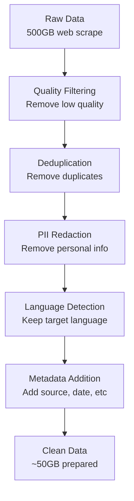
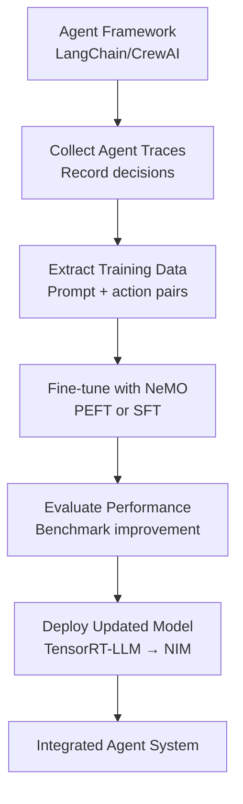
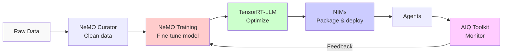

# NVIDIA NeMO Framework (Domain 7)

## Overview

NVIDIA NeMO is an open-source framework for building, training, and fine-tuning large language models and multimodal models. It provides production-ready tools for model development, data curation, and deployment.

---

## Part 1: NeMO Framework Fundamentals

### What is NeMO?

**NeMO = NVIDIA Customizable Language Models**

**Core components:**
1. **Model implementations** - GPT, T5, diffusion models
2. **Training framework** - Distributed training at scale
3. **Data curation pipeline** - NeMO Curator (preprocessing)
4. **Fine-tuning tools** - PEFT, SFT, DPO
5. **Inference optimizations** - Integration with TensorRT-LLM
6. **Prompt learning** - In-context learning without full fine-tune

### When to Use NeMO

| Use Case | Solution |
|----------|----------|
| **Use pre-trained models** | NIMs (faster, pre-optimized) |
| **Fine-tune for domain** | NeMO + PEFT (parameter-efficient) |
| **Custom architecture** | NeMO native training |
| **Data quality matters** | NeMO Curator (preprocessing) |
| **Production deployment** | NeMO → TensorRT-LLM → NIM |

---

## Part 2: NeMO Fine-Tuning

### Fine-Tuning Approaches Comparison

| Approach | Cost | Quality | When to Use |
|----------|------|---------|------------|
| **PEFT (LoRA)** | 1 GPU, <1 hour | Good, task-specific | Default choice |
| **SFT (Full)** | 8 GPUs, 1 day | Excellent, general | Critical quality needs |
| **DPO (Preference)** | 4 GPUs, 12 hours | Very high, aligned | RLHF replacement |
| **Prompt Learning** | 1 GPU, 30 mins | Limited | Quick experiments |

### PEFT (Parameter Efficient Fine-Tuning)

**Concept:** Fine-tune a small percentage of parameters, keep base model frozen.

```python
from nemo.collections.nlp.models import GPTModel
from peft import get_peft_model, LoraConfig

# Load base model
model = GPTModel.restore_from("llama2-7b.nemo")

# Configure LoRA
peft_config = LoraConfig(
    r=16,                          # LoRA rank
    lora_alpha=32,                 # Scaling factor
    target_modules=["q_proj", "v_proj"],  # Which layers
    lora_dropout=0.1,
    bias="none"
)

# Apply LoRA
model = get_peft_model(model, peft_config)

# Show trainable parameters
trainable = sum(p.numel() for p in model.parameters() if p.requires_grad)
total = sum(p.numel() for p in model.parameters())
print(f"Trainable: {trainable/1e6:.1f}M / {total/1e9:.1f}B ({100*trainable/total:.1f}%)")
# Output: Trainable: 8.4M / 7.0B (0.1%) ← Much smaller!
```

**Benefits:**
- ✅ 10-20x smaller checkpoint files
- ✅ Faster training (1-2 hours vs 1+ day)
- ✅ Multiple LoRA adapters per base model
- ✅ Memory-efficient (fit on single GPU)

### SFT (Supervised Fine-Tuning)

**Full fine-tuning approach** - update all model weights.

```python
from nemo.collections.nlp.models import GPTModel
from nemo.core.config import DictConfig

# Load base model
model = GPTModel.restore_from("llama2-70b.nemo")

# Prepare training data (chat format)
training_data = [
    {
        "input": "What is machine learning?",
        "output": "Machine learning is..."
    },
    ...
]

# Configure training
trainer_config = DictConfig({
    "devices": 8,                  # Use 8 GPUs
    "max_steps": 10000,
    "val_check_interval": 500,
    "learning_rate": 2e-5,
    "warmup_steps": 500
})

# Train
model.train(training_data, trainer_config)

# Save fine-tuned model
model.save_to("llama2-70b-finetuned.nemo")
```

**Cost-benefit:**
```
7B model:
- Training: 1 GPU, 2-4 hours
- Improvement: +15-30% task accuracy

70B model:
- Training: 8 GPUs, 1-3 days
- Improvement: +20-40% task accuracy
```

### DPO (Direct Preference Optimization)

**Alternative to RLHF** - directly optimize for preferred outputs.

```python
from nemo.collections.nlp.algorithms import DPO

# Prepare preference data
preference_data = [
    {
        "prompt": "What is the capital of France?",
        "preferred": "Paris is the capital of France.",
        "rejected": "The capital is London."  # Wrong answer
    },
    ...
]

# Configure DPO
dpo_config = DictConfig({
    "beta": 0.1,                   # Divergence penalty
    "temperature": 0.5,
    "learning_rate": 1e-5
})

# Train
model.train_with_dpo(preference_data, dpo_config)

# Result: Model learns to prefer correct outputs
```

**When to use DPO:**
- ✅ Need alignment without RLHF complexity
- ✅ Have preference pairs (easier to collect)
- ✅ Want faster training than RLHF

---

## Part 3: NeMO Curator - Data Preparation

### The Data Curation Pipeline

**Problem:** Raw data contains noise, duplication, low-quality content.

**Solution:** NeMO Curator systematically cleans and prepares data.



### Quality Filtering

```python
from nemo_curator import QualityFilter

# Configure filters
quality_config = {
    "min_length": 50,              # Minimum tokens
    "max_length": 4096,            # Maximum tokens
    "min_unique_ratio": 0.5,       # 50% unique words
    "max_duplicate_ratio": 0.3,    # Max 30% exact duplicates
    "language": "en",              # English only
    "toxic_score_threshold": 0.7,  # Filter toxic content
}

# Apply filtering
filtered_data = QualityFilter(**quality_config).filter(raw_data)

# Result: Removes low-quality documents
print(f"Reduced: {len(raw_data)} → {len(filtered_data)} documents")
```

### Deduplication

```python
from nemo_curator import Deduplicator

# Configure deduplication
dedup_config = {
    "strategy": "exact",           # or "fuzzy", "semantic"
    "hash_method": "md5",
    "batch_size": 10000
}

# Deduplicate
deduplicator = Deduplicator(**dedup_config)
deduplicated = deduplicator.deduplicate(filtered_data)

# Result: Removes exact and near-duplicate documents
print(f"Deduplicated: {len(filtered_data)} → {len(deduplicated)} documents")
```

### PII Redaction

```python
from nemo_curator import PIIRedactor

# Configure PII detection
pii_config = {
    "patterns": ["email", "phone", "ssn", "credit_card"],
    "method": "redact"  # or "mask", "remove"
}

# Apply redaction
redactor = PIIRedactor(**pii_config)
clean_data = redactor.redact(deduplicated)

# Example:
# Before: "Contact John at john@company.com or (555) 123-4567"
# After:  "Contact [NAME] at [EMAIL] or [PHONE]"
```

### Data Curation ROI

```
Case Study: Training 7B model

Without Curator:
- Raw data: 500GB
- Training time: 7 days
- Model quality: 75% accuracy

With Curator:
- Cleaned data: 120GB (-76%)
- Training time: 2 days (-71%)
- Model quality: 88% accuracy (+13%)

ROI: 3x faster training, +13% accuracy, -76% storage
```

---

## Part 4: NeMO Training at Scale

### Distributed Training Setup

**Multi-GPU Training (Tensor Parallelism)**

```python
from nemo.core import ModelPT
from nemo.utils import exp_manager

# Model with tensor parallelism
model_config = {
    "tensor_model_parallel_size": 4,  # Split model across 4 GPUs
    "pipeline_model_parallel_size": 2,  # 2 pipeline stages
    "virtual_pipeline_model_parallel_size": 4,  # Interleaving
}

# Training configuration
trainer = Trainer(
    devices=8,                         # 8 GPUs total
    max_steps=100000,
    accumulate_grad_batches=8,
    gradient_clip_val=1.0,
    precision="bf16"                   # Mixed precision
)

# Initialize model
model = GPTModel(model_config)

# Train
trainer.fit(model, datamodule)
```

**Performance scaling:**
```
1 GPU:    10 tokens/sec
2 GPUs:   19 tokens/sec (1.9x)
4 GPUs:   38 tokens/sec (3.8x)
8 GPUs:   75 tokens/sec (7.5x)

Scaling efficiency: ~94% (optimal is 100%, practical limit ~80%)
```

### Memory Optimization

| Technique | Memory Saved | Trade-off |
|-----------|--------------|-----------|
| **Gradient Checkpointing** | 30% | Slower forward pass |
| **Activation Checkpointing** | 50% | 20% slower training |
| **Flash Attention** | 25% | v100/older GPUs slower |
| **All combined** | 70% | ~30% slower training |

**Decision:** Use combination to fit larger models on available hardware.

---

## Part 5: NeMO Integration with Agents

### Training Agent-Specific Models

**Scenario:** Your agents need specialized reasoning for your domain.

```python
from nemo.collections.nlp.models import GPTModel

# 1. Prepare domain-specific training data
domain_data = [
    {
        "input": "Agent scenario: Customer has issue X",
        "output": "Agent action: Call function Y with params Z"
    },
    # ... 1000+ examples
]

# 2. Fine-tune on domain data
model = GPTModel.restore_from("llama2-7b.nemo")
model.fine_tune(domain_data, epochs=3)

# 3. Export to deployment format
model.save_to("domain-agent-7b.nemo")

# 4. Convert to TensorRT-LLM optimized format
from nemo.export import TensorRTLLMConverter
converter = TensorRTLLMConverter()
optimized = converter.convert("domain-agent-7b.nemo")

# 5. Deploy as NIM
docker run nvcr.io/nim/domain-agent-7b:latest
```

### Agent Training Workflow



---

## Part 6: Exam-Focused NeMO Patterns

### Common Exam Questions

**Q: "Domain-specific agent is too slow. How to optimize with NeMO?"**
```
Answer (in order):
1. Fine-tune smaller model (7B instead of 70B) with LoRA
2. Measure impact on accuracy
3. If acceptable: Deploy 7B (6x faster, 10x smaller)
4. If not: Add prompt engineering to 7B instead of larger model
5. Last resort: Fine-tune 70B with tensor parallelism

Result: 3-10x faster agents with proper tuning
```

**Q: "Training data has quality issues. How to handle?"**
```
Answer: Use NeMO Curator:
1. Quality filtering (remove short/toxic docs)
2. Deduplication (remove duplicates)
3. PII redaction (remove personal info)
4. Language detection (keep target language only)

Expected: -70% data size, +15% model accuracy
```

**Q: "Need to fine-tune 70B model for lending decisions. Resources?"**
```
Answer:
1. Gather 500+ lending decision examples
2. Prepare using NeMO Curator
3. Fine-tune with DPO (faster than SFT)
4. Evaluate: Accuracy, bias, regulatory compliance
5. Deploy with Triton + automatic failover

Timeline: 3-5 days for production system
```

**Q: "Which fine-tuning approach for quick pilot?"**
```
Answer: LoRA (PEFT)
- Time: 1-2 hours on 1 GPU
- Quality: Good for domain tasks
- Storage: 100MB adapter vs 13GB model
- Cost: ~$1 in compute vs $50+ for SFT

Trade-off: Good results, quick iteration, suitable for pilot
```

---

## Part 7: NeMO Ecosystem

### Related NVIDIA Tools

| Tool | Purpose | Integration |
|------|---------|-----------|
| **NeMO** | Train/fine-tune models | Export to TensorRT-LLM |
| **TensorRT-LLM** | Optimize for inference | Package in NIMs |
| **Triton** | Model serving (multi-framework) | Runs optimized models |
| **AIQ Toolkit** | Evaluate trained models | Monitors production deployment |

### Complete Workflow



---

## Related Concepts

- **Fine-tuning strategies** (03-evaluation-and-tuning): Impact on model quality
- **TensorRT-LLM** (07-nvidia-platform): Optimization after training
- **Agents with custom models** (02-agent-development): Using NeMO-trained models
- **Data quality in RAG** (06-knowledge-integration-data): NeMO Curator role
