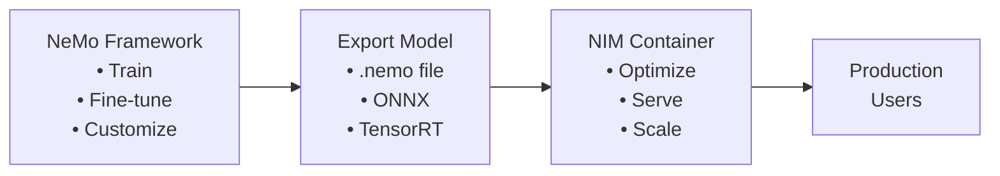
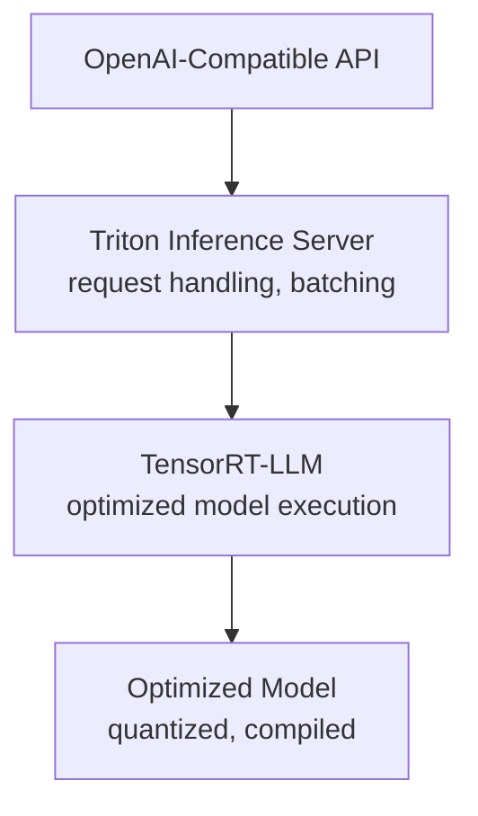

# Difference between NIM and Nemo

# Quick Summary

| Component | Purpose | Think of it as... |
| --- | --- | --- |
| **NeMo Framework** | Training & fine-tuning models | The **kitchen** where you cook/prepare the model |
| **NIM (NVIDIA Inference Microservices)** | Deploying & serving models | The **restaurant** that serves the finished dish |

```
NeMo (Training) → Model → NIM (Deployment) → Users
```

---

# NeMo Framework

## What It Is

**NeMo** (Neural Modules) is NVIDIA's framework for **building, training, and fine-tuning** AI models, especially:

- Large Language Models (LLMs)
- Speech recognition (ASR)
- Text-to-speech (TTS)
- Conversational AI

## When to Use NeMo

| Use Case | NeMo? |
| --- | --- |
| Fine-tune Llama on company data | ✅ Yes |
| Train a custom speech model | ✅ Yes |
| Customize a model for your domain | ✅ Yes |
| Serve a model in production | ❌ No (use NIM) |
| Deploy an API endpoint | ❌ No (use NIM) |

## Key NeMo Components

| Component | Purpose |
| --- | --- |
| **NeMo Framework** | Core training/fine-tuning toolkit |
| **NeMo Guardrails** | Safety rails for deployed agents |
| **NeMo Curator** | Data curation for training |
| **NeMo Aligner** | RLHF and alignment tools |

## Example NeMo Workflow

```python
# Fine-tuning with NeMo
from nemo.collections.nlp.models import MegatronGPTModel

# Load pre-trained model
model = MegatronGPTModel.restore_from("base_model.nemo")

# Fine-tune on your data
trainer = Trainer(max_epochs=3, gpus=8)
trainer.fit(model, train_dataloader)

# Save fine-tuned model
model.save_to("finetuned_model.nemo")

# Next step: Export to NIM for deployment!
```

---

# NIM (NVIDIA Inference Microservices)

## What It Is

**NIM** is NVIDIA's solution for **deploying optimized models as containerized microservices**. It packages:

- TensorRT-LLM optimizations
- Triton Inference Server
- Standard APIs
- Container orchestration

Into **ready-to-deploy containers**.

## When to Use NIM

| Use Case | NIM? |
| --- | --- |
| Deploy LLM to production | ✅ Yes |
| Serve multiple models via API | ✅ Yes |
| Kubernetes deployment | ✅ Yes |
| Easy model swapping without code changes | ✅ Yes |
| Train or fine-tune a model | ❌ No (use NeMo) |

## Key NIM Features

| Feature | Benefit |
| --- | --- |
| **Pre-optimized** | TensorRT-LLM baked in, no manual optimization |
| **Containerized** | Docker/Kubernetes ready |
| **Standard API** | OpenAI-compatible endpoints |
| **Model catalog** | Many models available as NIMs |
| **Scalable** | Works with Kubernetes autoscaling |

## Example NIM Deployment

```bash
# Pull and run a NIM container
docker run -d --gpus all \
  -p 8000:8000 \
  -e NGC_API_KEY=$NGC_API_KEY \
  nvcr.io/nim/meta/llama3-70b-instruct:latest

# Now you have an API endpoint!
curl http://localhost:8000/v1/chat/completions \
  -H "Content-Type: application/json" \
  -d '{
    "model": "llama3-70b-instruct",
    "messages": [{"role": "user", "content": "Hello!"}]
  }'
```

---

# Side-by-Side Comparison

| Aspect | NeMo Framework | NIM |
| --- | --- | --- |
| **Primary purpose** | Training, fine-tuning | Deployment, serving |
| **Input** | Data, base models | Trained models |
| **Output** | Trained/fine-tuned models | API endpoints |
| **When in lifecycle** | Development phase | Production phase |
| **Optimization focus** | Training efficiency | Inference efficiency |
| **Requires GPU for** | Training workloads | Inference workloads |
| **Scaling** | Distributed training | Distributed inference |
| **APIs** | Python training APIs | REST/gRPC inference APIs |

---

# How They Work Together



---

# NIM Architecture (Under the Hood)

NIM bundles several NVIDIA technologies:



---

# Exam Question Patterns

**Q: You need to fine-tune an LLM on proprietary company data. Which NVIDIA tool?**

A: **NeMo Framework**

**Q: You need to deploy multiple LLMs with a standardized API. Which NVIDIA tool?**

A: **NIM**

**Q: You want optimized inference with easy Kubernetes deployment. Which tool?**

A: **NIM**

**Q: You need to train a custom speech recognition model. Which tool?**

A: **NeMo Framework**

**Q: You want model updates without changing application code. Which tool?**

A: **NIM** (swap containers, API stays the same)

---

# Related NVIDIA Components

| Component | Role | Relation to NeMo/NIM |
| --- | --- | --- |
| **TensorRT-LLM** | LLM optimization library | Bundled inside NIM |
| **Triton Inference Server** | Model serving platform | Bundled inside NIM |
| **NeMo Guardrails** | Safety rails | Works with NIM-deployed models |
| **AIQ Toolkit** | Agent building & monitoring | Connects to NIM for inference |

---

# Memory Trick

```
NeMo = "Neural Modules" = Building blocks for MAKING models
NIM  = "Inference Microservices" = SERVING models to users

NeMo → Make it
NIM  → Ship it
```

---

# Common Exam Traps

| Trap | Reality |
| --- | --- |
| "Use NeMo for production deployment" | NeMo is for training; use NIM for deployment |
| "Use NIM to fine-tune models" | NIM is for serving; use NeMo for fine-tuning |
| "NIM replaces Triton" | NIM includes Triton inside it |
| "NeMo and NIM are competitors" | They're complementary - different lifecycle stages |
