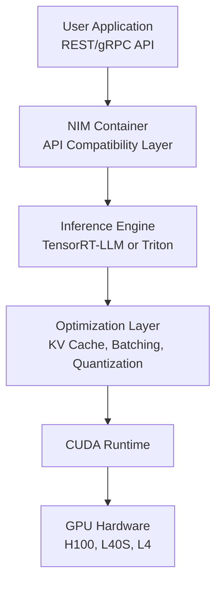
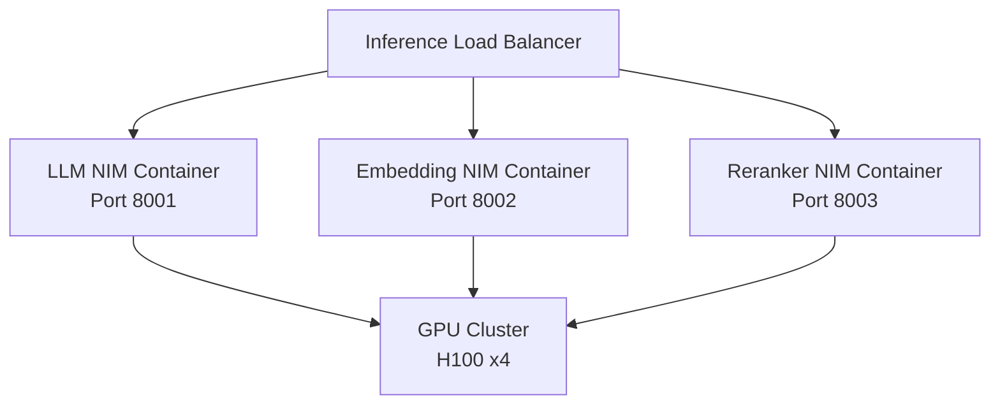
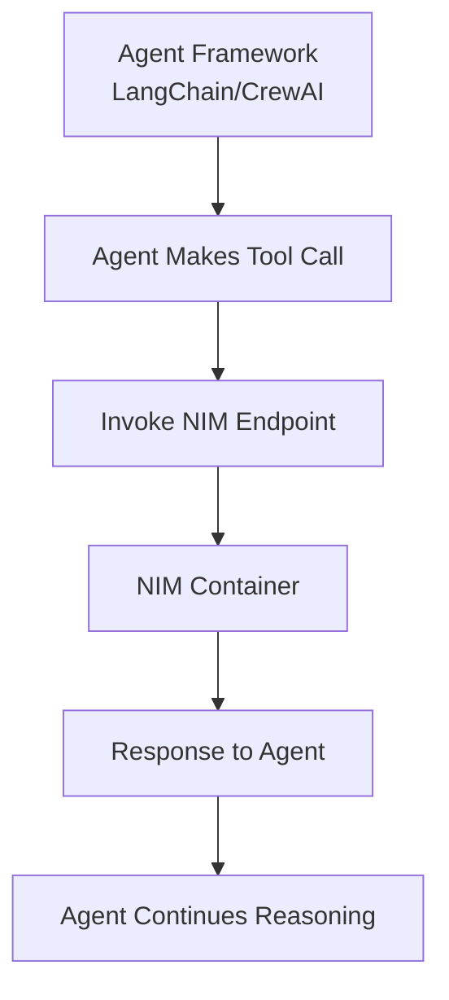

# NVIDIA Inference Microservices (NIMs) (Domain 7)

## Overview

NVIDIA Inference Microservices (NIMs) are containerized, pre-optimized, production-ready inference engines for deploying LLMs and other AI models. NIMs abstract away the complexity of infrastructure and optimization, allowing developers to focus on building applications.

---

## Part 1: NIMs Fundamentals

### What are NIMs?

**Definition:** Pre-optimized, containerized microservices that package:
- ✅ Pre-compiled optimized inference engines (TensorRT-LLM, TensorRT, Triton)
- ✅ Model weights (or pointer to weights)
- ✅ Runtime configuration and defaults
- ✅ API-compatible inference interface
- ✅ Monitoring and health checks

**Key Advantage:** Deploy optimized models in minutes, not weeks of tuning.

### NIM Deployment Models

| Model | Use Case | Deployment | Optimization |
|-------|----------|-----------|--------------|
| **Hosted/SaaS** | No infrastructure concerns | NVIDIA cloud managed | NVIDIA tunes and manages |
| **Self-hosted on-prem** | Data privacy, control | Your GPU cluster | NVIDIA pre-optimizes, you deploy |
| **Edge deployment** | Local inference, no latency | Local GPU or CPU | Quantized, distilled models |

**Production insight:** Self-hosted NIMs are the most common for enterprise - you get optimization + control.

### NIM Architecture Stack



**Stack layers:**
1. **API Layer**: REST/gRPC endpoints matching OpenAI API
2. **Inference Engine**: TensorRT-LLM (LLMs) or Triton (multimodal)
3. **Optimization**: Applied by NIM at deployment time
4. **Runtime**: CUDA kernel execution
5. **Hardware**: GPU

---

## Part 2: NIM Types and Use Cases

### LLM NIMs

**Standard LLM NIMs** - Full-precision models on A100/H100:
```
Supported Models:
- Llama 2, Llama 3 (7B-70B)
- Mistral, Mixtral
- Nemotron (NVIDIA's proprietary models)
- Meta's LLaMA variants
```

**Features:**
- ✅ Multi-GPU support via tensor parallelism
- ✅ Dynamic batching across requests
- ✅ Built-in token streaming
- ✅ OpenAI API compatibility

**Deployment example:**
```bash
# Pull and run NIM
docker run -d --gpus all \
  -e NVIDIA_CUDA_COMPUTE_CAPABILITY=8.0 \
  -p 8000:8000 \
  nvcr.io/nim/meta-llama/llama2-70b-chat:latest

# Query via OpenAI-compatible API
curl -X POST http://localhost:8000/v1/chat/completions \
  -H "Content-Type: application/json" \
  -d '{
    "model": "meta-llama-2-70b-chat-q4",
    "messages": [{"role": "user", "content": "Hello"}]
  }'
```

### Embedding NIMs

**Purpose:** Generate dense vector embeddings for RAG and similarity search.

**Features:**
- ✅ Optimized for batch processing
- ✅ Normalized embeddings (cosine distance)
- ✅ Input length up to 512 tokens

**Common models:**
- NVIDIA NV-Embed-v2
- BGE-large (Alibaba)
- E5-large (Microsoft)

**Use in production:**
```python
from openai import OpenAI

client = OpenAI(base_url="http://localhost:8000/v1", api_key="unused")

# Index time
docs = ["Document 1", "Document 2", ...]
embeddings = client.embeddings.create(
    model="nv-embed-v2",
    input=docs
)
# Store embeddings in vector DB

# Query time
query_embedding = client.embeddings.create(
    model="nv-embed-v2",
    input=["What is X?"]
)
# Search vector DB
```

### Multimodal NIMs

**Vision + Language models** for image understanding:

| NIM | Capability | Input |
|-----|-----------|-------|
| **CLIP** | Image classification + text | Image + text |\nVLM2B** | Image captioning, VQA | Image |\n| **LLaVA** | Visual question answering | Image + text question |

---

## Part 3: NIM Optimizations

### TensorRT-LLM Integration

NIMs use TensorRT-LLM (NVIDIA's optimized inference library) under the hood:

| Optimization | Method | Benefit |
|---|---|---|
| **Quantization** | INT8 or FP8 weights | 2-4x throughput increase |
| **Paged Attention** | Flexible KV cache allocation | 4x+ batch size increase |
| **KV Cache Optimization** | Reuse/compact representation | 40-60% memory reduction |
| **Tensor Parallelism** | Split model across GPUs | Scale to 8+ GPUs seamlessly |
| **In-Flight Batching** | Token-level batching | Continuous throughput vs batch waiting |
| **Custom CUDA Kernels** | Optimized fused operations | Attention, embed, decode are 2-3x faster |

**Example: Quantization impact**
```
Original (FP32):
- Throughput: 100 tokens/sec
- Memory: 70 GB

Quantized (INT8):
- Throughput: 280 tokens/sec (+180%)
- Memory: 18 GB (-74%)
```

### NIM Configuration

NIMs allow tuning via environment variables and config files:

```yaml
# NIM config example
model:
  name: meta-llama-2-70b-chat
  tensor-parallel-size: 4        # Span 4 GPUs
  pipeline-parallel-size: 1

inference:
  max-batch-size: 32             # Dynamic batching
  max-tokens: 512
  temperature: 0.7
  top-p: 0.9

optimization:
  quantization: int8             # Enable quantization
  enable-paged-attention: true
  enable-in-flight-batching: true
```

---

## Part 4: Production NIM Deployment

### Multi-Model Deployment

**Scenario:** Run multiple models simultaneously (LLM + embedding + reranker)



**Best practices:**
1. **Dedicated GPU** per model for isolation
2. **Load balancer** routes requests to correct NIM
3. **Health checks** ensure all NIMs are running
4. **Graceful shutdown** during updates

### High Availability NIM Setup

**Multi-instance deployment:**
```yaml
version: "3.9"
services:
  nim-primary:
    image: nvcr.io/nim/meta-llama/llama2-70b:latest
    gpus: [0, 1]
    ports: ["8001:8000"]
    environment:
      TENSOR_PARALLEL_SIZE: 2

  nim-secondary:
    image: nvcr.io/nim/meta-llama/llama2-70b:latest
    gpus: [2, 3]
    ports: ["8002:8000"]
    environment:
      TENSOR_PARALLEL_SIZE: 2

  load-balancer:
    image: nginx:latest
    ports: ["8000:8000"]
    volumes:
      - ./nginx.conf:/etc/nginx/nginx.conf
    depends_on:
      - nim-primary
      - nim-secondary
```

**Nginx load balancing:**
```nginx
upstream nims {
    server nim-primary:8000 weight=1;
    server nim-secondary:8000 weight=1;
}

server {
    listen 8000;

    location /v1/chat/completions {
        proxy_pass http://nims;
        proxy_buffering off;        # For streaming
        proxy_set_header Connection "";
    }
}
```

### Scaling Considerations

| Factor | Consideration | Solution |
|--------|---|---|
| **Model size** | 70B model needs 140GB VRAM | Use tensor parallelism across GPUs |
| **Batch size** | Higher batch = more requests but higher latency | Use dynamic batching + paged attention |
| **Multiple models** | GPU memory contention | Separate GPUs per model or load balancer |
| **Inference latency** | Streaming needed for responsiveness | Enable token streaming in NIM |

---

## Part 5: Monitoring NIMs

### Key Metrics

```
1. Throughput Metrics
   - Tokens/second generated
   - Requests/second processed
   - Batch efficiency (actual batch size vs max)

2. Latency Metrics
   - Time to first token (TTFT) - P50, P99
   - Inter-token latency - should be consistent
   - End-to-end request latency

3. Resource Metrics
   - GPU utilization (should be 80-95%)
   - GPU memory usage
   - GPU temperature

4. Error Metrics
   - OOM errors (out of memory)
   - Timeout errors
   - API errors
```

### Monitoring with Prometheus

```python
from prometheus_client import Counter, Histogram, Gauge

# Custom metrics
token_counter = Counter('nim_tokens_generated_total', 'Tokens generated')
latency_histogram = Histogram('nim_request_latency_seconds', 'Request latency')
gpu_memory_gauge = Gauge('nim_gpu_memory_bytes', 'GPU memory used')

# In inference loop
@app.post("/v1/chat/completions")
async def infer(request):
    start = time.time()

    response = await nim_client.infer(request)

    latency_histogram.observe(time.time() - start)
    token_counter.inc(response.usage.completion_tokens)
    gpu_memory_gauge.set(get_gpu_memory())

    return response
```

---

## Part 6: NIM vs Traditional Deployment

### Comparison Matrix

| Aspect | NIM | Manual TensorRT-LLM | Raw vLLM |
|--------|-----|-------------------|----------|
| **Setup time** | Minutes | Days/weeks | Hours |
| **Optimization level** | Maximum (NVIDIA-tuned) | Manual tuning needed | Community optimized |
| **API compatibility** | OpenAI standard | Custom | Custom |
| **Multi-model support** | Native | Manual orchestration | Manual |
| **Support** | NVIDIA enterprise support | Community/self | Community |
| **Cost** | License fee | Free/self-managed | Free |

**When to use NIM:**
- ✅ Production enterprise systems (need support + optimization)
- ✅ Multiple models (easier orchestration)
- ✅ Compliance requirements (audit trails)
- ✅ Time to market is critical

**When to use manual deployment:**
- ✅ Cost-sensitive testing environments
- ✅ Highly customized inference needs
- ✅ Research/experimentation

---

## Part 7: Exam-Focused NIM Patterns

### Common Exam Questions

**Q: "Agent needs to do RAG. Which NIM pattern?"**
```
Answer:
1. Embedding NIM for vectorization
2. LLM NIM for generation
3. Optionally: Reranker NIM for filtering

Deploy as:
- Embedding NIM: 1 GPU, high throughput
- LLM NIM: 2 GPUs with tensor parallelism
- Reranker NIM: Shared GPU (lightweight)
```

**Q: "How to handle multiple concurrent agents?"**
```
Answer: Use dynamic batching + load balancer
- Each agent gets a separate inference request
- NIM batches them automatically
- Load balancer distributes across NIM instances
- Result: 1 NIM instance handles 32+ concurrent agents
```

**Q: "NIM is running out of memory on requests. How to fix?"**
```
Answer: Options in priority order:
1. Enable paged attention (free memory boost)
2. Enable quantization (INT8 = 4x memory reduction)
3. Reduce max-batch-size
4. Add another GPU (tensor parallelism)
```

**Q: "Production RAG system has 100ms latency requirement. NIM config?"**
```
Answer:
- Enable streaming (don't wait for full response)
- Reduce max-batch-size to 4-8 (lower batching latency)
- Use embedding NIM locally for instant vectorization
- Acceptable trade-off: 20 tokens/sec vs 200 tokens/sec
```

---

## Part 8: Integration with Agents

### Agent + NIM Architecture



### LangChain Integration

```python
from langchain.llms import OpenAI

# Point to self-hosted NIM
llm = OpenAI(
    api_key="unused",
    base_url="http://localhost:8000/v1"
)

# Use in agent
from langchain.agents import AgentType, initialize_agent

agent = initialize_agent(
    tools,
    llm,
    agent=AgentType.OPENAI_FUNCTIONS,
    verbose=True
)

response = agent.run("Help me with this task")
```

### CrewAI Integration

```python
from crewai import Agent, Task, Crew
from langchain.llms import OpenAI

# Configure LLM to use NIM
llm = OpenAI(
    model="meta-llama-2-70b-chat",
    api_key="unused",
    base_url="http://localhost:8000/v1"
)

# Create agent
agent = Agent(
    role="researcher",
    goal="Research the topic",
    llm=llm
)

# Create task
task = Task(description="Research AI", agent=agent)

# Run
crew = Crew(agents=[agent], tasks=[task])
result = crew.kickoff()
```

---

## Related Concepts

- **TensorRT-LLM**: Underlying optimization engine (03-evaluation-and-tuning)
- **Triton Inference Server**: Alternative inference serving platform (07-nvidia-platform)
- **Agent Frameworks**: LangChain, CrewAI integration (02-agent-development)
- **Deployment Patterns**: Scaling and HA (04-deployment-and-scaling)
