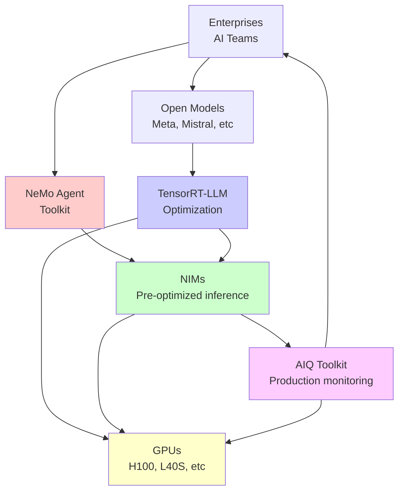

# NVIDIA's Role in the Agentic AI Ecosystem (Domain 7)

## Overview

NVIDIA's position in agentic AI: Hardware provider, optimization specialist, and end-to-end platform provider.

---

## Part 1: NVIDIA's Three Roles

### Role 1: Hardware Provider

**Primary business: GPUs for AI**

| Product Line | Use Case | Market |
|---|---|---|
| **H100** | Training, large-scale inference | Data centers |
| **L40S** | Mixed inference loads | Enterprise |
| **L4** | Cost-effective inference | Cloud providers |
| **RTX 6000** | Professional workstations | Design/VFX |
| **Grace Hopper** | CPU+GPU unified memory | HPC |

**Exam insight:** Hardware dominance doesn't guarantee software lock-in. NVIDIA works with open ecosystems.

### Role 2: Optimization Specialist

**Core competency: Making models run fast**

```
Raw LLM on GPU: 10 tokens/sec
↓ Apply TensorRT-LLM optimizations
↓ KV cache, paged attention, quantization
↓ Custom CUDA kernels, in-flight batching
Final result: 80+ tokens/sec (8x faster)
```

**Why NVIDIA excels:**
- ✅ Owns CUDA ecosystem
- ✅ Deepest GPU hardware knowledge
- ✅ Custom kernel expertise
- ✅ Decades of optimization experience

### Role 3: Platform Provider

**Newest role: Complete agentic AI stack**

```
Traditional:
  You → Pick framework → Write agents → Deploy

NVIDIA's vision:
  You → NIM (inference) + NAT (agent platform) + AIQ (monitoring)
         Unified, optimized, production-ready
```

**Strategic intent:** Own entire agentic AI deployment stack.

---

## Part 2: How NVIDIA Competes

### vs. Open-Source Inference (vLLM, llama.cpp)

| Aspect | NVIDIA | Open Source |
|--------|--------|------------|
| **Speed** | Fastest (custom kernels) | Good (60% of NVIDIA) |
| **Ease of use** | Very easy (NIMs) | Moderate (setup needed) |
| **Support** | Enterprise (guaranteed) | Community (best effort) |
| **Cost** | License fee | Free |
| **Hardware** | GPU specific | Any GPU |

**NVIDIA advantage:** 2-3x faster = more throughput = lower costs at scale

**Open-source advantage:** Zero licensing cost = good for cost-sensitive

### vs. Cloud Providers (AWS, Azure, GCP)

| Aspect | NVIDIA | Cloud Provider |
|--------|--------|---|
| **Control** | Full control of setup | Managed, less control |
| **Cost** | Pay for resources | Per-request/per-hour |
| **Flexibility** | Complete freedom | Limited to their services |
| **Compliance** | On-premise option | Shared infrastructure |
| **Optimization** | Maximum tuning possible | Vendor-optimized |

**NVIDIA advantage:** Maximum control and customization

**Cloud advantage:** Automatic scaling, less ops work

### vs. Other AI Companies (OpenAI, Anthropic)

**OpenAI/Anthropic position:** Model providers (API-first)
```
OpenAI (API):
  - You send request to API
  - OpenAI runs inference
  - You pay per token
  - No control over hardware/inference
```

**NVIDIA position:** Infrastructure provider
```
NVIDIA (Platform):
  - You deploy models you choose
  - You control inference
  - You manage infrastructure
  - NVIDIA provides tools + optimization
```

---

## Part 3: NVIDIA's Agentic AI Strategy

### The Platform Vision



**Strategic positioning:**
- **NAT**: Control how agents are built
- **NIMs**: Control inference delivery
- **AIQ**: Control production monitoring
- **TensorRT-LLM**: Control optimization
- **Hardware**: Control base infrastructure

**Result:** Complete value chain = vendor lock-in potential, but with open standards

### NVIDIA's Ecosystem Play

**Key principle:** NVIDIA works WITH open ecosystem, not against it

```
NVIDIA's partnerships:
- LangChain: Native NIM support
- CrewAI: Easy NVIDIA integration
- Meta: LLaMA 2 optimizations
- Together AI: NVIDIA infrastructure
- Hugging Face: Model hub integration
- Open standards: MCP (Model Context Protocol)
```

**Exam insight:** NVIDIA doesn't force you to use only NVIDIA. But if you do, you get best optimization.

---

## Part 4: When to Use NVIDIA Solutions

### Greenlight for NVIDIA Platform

```
✅ Use NVIDIA if:

1. Performance matters (2-3x speedup valuable)
2. Scale matters (cost savings significant)
3. Production deployment (support + reliability)
4. Budget available (licensing + infrastructure)
5. Enterprise needs (compliance, SLAs)
```

**Example:** Company deploying agent to 100M+ users
```
Open source cost: 10 req/sec, need 100 GPUs = $50k/month
NVIDIA cost: 30 req/sec (3x faster), need 35 GPUs = $20k/month
Savings: $30k/month = $360k/year
License cost: $50k/year
Net savings: $310k/year ← Clear ROI
```

### Greenlight for Open-Source

```
✅ Use open-source if:

1. Cost-sensitive (research, early stage)
2. Simple deployments (single model)
3. Competitive advantage in software, not inference
4. Non-GPU hardware (TPUs, Apple Silicon)
5. Minimal production SLA needs
```

**Example:** Startup building proprietary agent logic
```
Startup value: Custom agent reasoning
Cost savings from open inference: Minimal benefit
License cost: Unnecessary overhead
Better approach: Use vLLM, invest in agent logic
```

---

## Part 5: NVIDIA's Certification Context

### Why NCP-AAI Exists

**Strategic question:** If NVIDIA owns hardware, why certify on agentic AI?

**Answer:** Market shift from model ownership to agent deployment

```
Past 2 years:
- API models (OpenAI, Claude) solved inference
- Companies use APIs (no infra needed)
- NVIDIA inference optimization less valuable

Current shift:
- Enterprises want proprietary models
- Fine-tuned models for domain
- Want to run on-premise (compliance)
- Need custom agents for workflows

Future (NVIDIA's bet):
- Every company has custom agents
- Agents run on NVIDIA GPUs
- Optimization + monitoring critical
- Certification shows expertise
```

**Exam's position in strategy:**
```
NCP-AAI certification signals:
- ✅ Know how to deploy agentic AI
- ✅ Understand NVIDIA tools deeply
- ✅ Can optimize for production
- ✅ Can monitor and maintain at scale

This builds demand for:
- ✅ NVIDIA hardware (GPUs)
- ✅ NVIDIA software (NIMs, AIQ)
- ✅ NVIDIA consulting services
- ✅ NVIDIA cloud partnerships
```

---

## Part 6: Exam-Focused NVIDIA Patterns

### Common Exam Questions

**Q: "Should we use NIMs or deploy models ourselves with TensorRT-LLM?"**
```
Answer: Depends on scale and budget:

Small scale (< 1000 req/day):
- Use NIMs (simpler, pre-optimized)
- Cost: ~$200/month software + GPU rental
- Effort: 2-4 hours setup

Large scale (100k+ req/day):
- Use TensorRT-LLM (full control, max optimization)
- Cost: Same GPU + $0 software (free)
- Effort: 2-4 weeks optimization

Trade-off: Simplicity vs control
```

**Q: "Our company is all-in on open-source. How to use NVIDIA?"**
```
Answer: NVIDIA supports open-source stack:
1. Use TensorRT-LLM (free, open source)
2. Deploy on NVIDIA GPUs
3. Optimize with NVIDIA tools
4. Use vLLM or similar (not NIM)

You get:
- ✅ Hardware advantage (fastest GPUs)
- ✅ Software optimization (TensorRT-LLM)
- ✅ No licensing costs
- ✅ Community support

Result: Get NVIDIA benefits without vendor lock-in
```

**Q: "What's the difference between NIM and self-hosted?"**
```
Answer: NIM vs Self-Hosted TensorRT-LLM

NIM (Hosted or containerized):
- Pre-configured, turn-key
- Automatic optimization
- NVIDIA support included
- Cost: License fee
- Good for: Rapid deployment, less ops

Self-hosted TensorRT-LLM:
- Full control over configuration
- Maximum customization
- Cost: Only infrastructure
- Effort: More setup and tuning
- Good for: Cost-sensitive, high-scale
```

**Q: "How does AIQ help with production agents?"**
```
Answer: AIQ provides three critical functions:

1. Continuous evaluation:
   - Track quality metrics automatically
   - Alert on performance degradation
   - Baseline + trending

2. Drift detection:
   - Identify distribution changes
   - Concept drift (input changes)
   - Label drift (output changes)
   - Alert before problems

3. Compliance monitoring:
   - Bias/fairness tracking
   - PII detection and prevention
   - Regulatory compliance
   - Audit trails for every decision

Result: Production confidence without manual monitoring
```

---

## Part 7: Future NVIDIA Roadmap

### Signals from NVIDIA Leadership

**Likely direction (based on recent announcements):**

```
1. Broader tool ecosystem
   - More pre-optimized models (NIMs)
   - More specialized toolkits (domain-specific)

2. Easier deployment
   - Kubernetes operators for easy scaling
   - Cloud marketplace integration
   - One-click deployment

3. Better integration
   - MCP standardization
   - Framework partnerships
   - Enterprise integrations

4. Advanced optimization
   - Continued TensorRT improvements
   - Custom CUDA kernel generation
   - Speculative decoding
   - New quantization methods

5. Enterprise features
   - Multi-tenancy
   - Advanced compliance
   - SLA guarantees
   - Premium support tiers
```

**Exam relevance:** Latest features on v1 exam likely to be tested.

---

## Part 8: NVIDIA's Competitive Advantages

### Why NVIDIA Likely to Win Agentic AI Market

```
1. Hardware dominance
   - 80%+ market share in AI GPUs
   - Lead in new architectures
   - Custom chip designs
   → Advantage: No alternative for large-scale inference

2. Optimization expertise
   - 20+ years CUDA ecosystem
   - Thousands of GPU engineers
   - TensorRT-LLM leadership
   → Advantage: 2-3x speedup vs competitors

3. Vertical integration
   - Hardware → Software → Services
   - Complete stack control
   - Unified ecosystem
   → Advantage: Best end-to-end experience

4. Relationships
   - 20+ year partnerships with cloud providers
   - Close ties with model companies
   - Enterprise trust
   → Advantage: Market access and credibility

5. Platform play
   - NOT just hardware anymore
   - Own inference stack (TensorRT, Triton, NIM)
   - Own agent platform (NAT, AIQ)
   → Advantage: Higher-margin software business
```

### NVIDIA's Risks

```
1. Hardware competition
   - AMD GPUS improving
   - Custom chips (Google TPU, etc)
   - Potential commoditization
   → Risk: Margin pressure

2. Open-source software
   - vLLM catches up in performance
   - Communities build free alternatives
   → Risk: Software strategy commoditizes

3. Cloud provider competition
   - AWS, Azure, GCP offer managed agents
   - Easier than NVIDIA deployment
   → Risk: Market consolidation to cloud

4. Model provider competition
   - OpenAI, Anthropic own user relationships
   - May bypass infrastructure
   → Risk: Disintermediation
```

---

## Related Concepts

- **NVIDIA NIMs** (07-nvidia-platform): The inference offering
- **TensorRT-LLM** (03-evaluation-and-tuning): The optimization technology
- **Deployment patterns** (04-deployment-and-scaling): How to run on NVIDIA infrastructure
