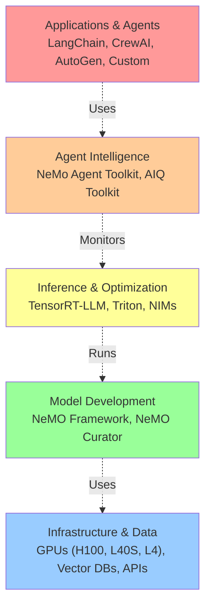
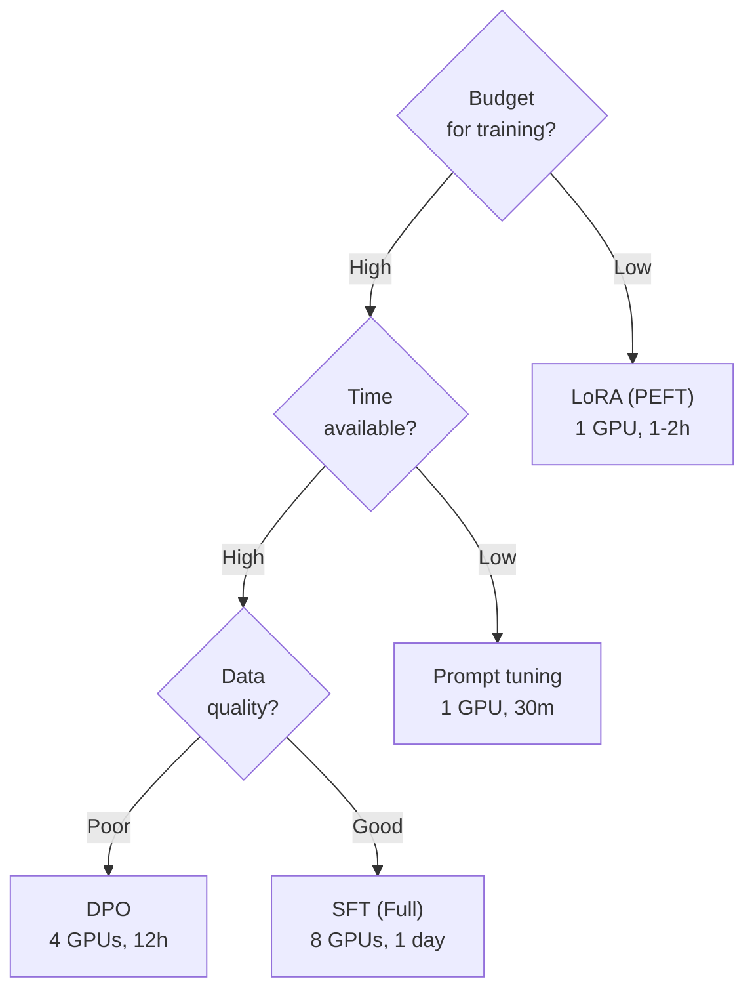
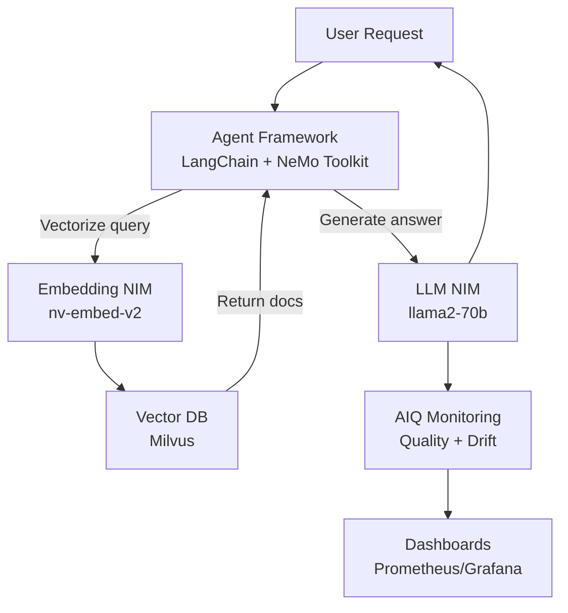

# NVIDIA Agentic AI Platform Components (Domain 7)

## Overview

Complete reference for NVIDIA's agentic AI platform stack, showing how components integrate and which to use for different scenarios.

---

## Part 1: Platform Stack Overview

### Layered Architecture



**Reading from bottom to top:**
- **Layer 1**: Raw resources (GPUs, storage, APIs)
- **Layer 2**: Model development tools (training, data prep)
- **Layer 3**: Optimized inference engines
- **Layer 4**: Agent-specific tools (memory, evaluation, monitoring)
- **Layer 5**: Agent frameworks and applications

---

## Part 2: Component Reference

### By Use Case

#### Scenario 1: Deploy Pre-Trained Model Quickly

```
Goal: Run LLaMA 2 70B in production tomorrow

Solution:
1. Use NIMs (pre-optimized, ready to go)
2. Optional: Configure dynamic batching
3. Deploy with docker-compose
4. Point agents to NIM endpoint

Timeline: 2-4 hours setup
Complexity: Low
Cost: Moderate (license + GPU time)
```

#### Scenario 2: Fine-Tune Model for Domain

```
Goal: Specialize LLaMA for customer support

Solution:
1. Prepare training data (500+ examples)
2. Use NeMO Curator to clean data
3. Fine-tune with NeMO (LoRA for speed)
4. Convert to TensorRT-LLM format
5. Deploy as NIM
6. Monitor with AIQ

Timeline: 3-5 days
Complexity: Medium
Cost: Moderate ($500-1000 compute)
```

#### Scenario 3: Production Agent System

```
Goal: Deploy multi-agent system with monitoring

Solution:
1. Develop agents in LangChain/CrewAI
2. Use NeMo Agent Toolkit for unified config
3. Inference via NIMs/Triton
4. Memory providers for state management
5. AIQ for monitoring and drift detection
6. Dashboards for observability

Timeline: 2-4 weeks
Complexity: High
Cost: High (ongoing infrastructure)
```

#### Scenario 4: Research & Experimentation

```
Goal: Try 10 different agent architectures quickly

Solution:
1. Use NeMO for custom model training
2. Lightweight inference (TensorRT-LLM)
3. Quick evaluation scripts
4. Don't deploy full production setup yet

Timeline: 1-2 weeks
Complexity: Medium
Cost: Low-moderate ($200-500)
```

---

## Part 3: Decision Trees

### Inference Engine Selection

```mermaid
graph TD
    Q1{"Pre-trained model<br/>or custom?"}
    Q2{"Scale:<br/>single GPU<br/>or multiple?"}
    Q3{"Models:<br/>one or many?"}
    Q4{"Latency<br/>critical?"}

    A1["Use NIM<br/>fastest deployment"]
    A2["Use TensorRT-LLM<br/>maximum control"]
    A3["Use Triton<br/>multi-model"}
    A4["Use vLLM<br/>open source"]

    Q1 -->|Pre-trained| A1
    Q1 -->|Custom| Q2
    Q2 -->|Single| Q3
    Q2 -->|Multiple| A3
    Q3 -->|One| Q4
    Q3 -->|Many| A3
    Q4 -->|Yes| A2
    Q4 -->|No| A4
```

### Model Training Approach



---

## Part 4: Component Comparison Matrix

### Inference Platforms

| Component | Model Size | Optimization | Multi-Model | Speed | Enterprise |
|-----------|-----------|---|---|---|---|
| **NIMs** | Any | Maximum | Yes | Fastest | Yes |
| **TensorRT-LLM** | Any | Manual | No | Very fast | Yes |
| **Triton** | Any | Optional | Yes | Fast | Yes |
| **vLLM** | <90B | Good | Yes | Fast | No |
| **llama.cpp** | <7B | Good | No | Moderate | No |

**Recommendations:**
- Production + Enterprise support → NIM
- Custom optimization needs → TensorRT-LLM
- Multiple diverse models → Triton
- Open source + research → vLLM

### Model Development

| Component | Use Case | Cost | Quality | Speed |
|-----------|----------|------|---------|-------|
| **NeMO PEFT** | Quick fine-tune | Low | Good | Fast |
| **NeMO SFT** | High quality | High | Excellent | Slow |
| **NeMO DPO** | Alignment | Medium | Very High | Medium |
| **NeMO Curator** | Data prep | Low | Critical | Depends on data |
| **Fine-tuning services** | Outsourced | High | Excellent | Slow |

**Recommendations:**
- Pilot/quick test → PEFT
- Production deployment → SFT
- Alignment critical → DPO
- Data quality matters → Always use Curator

### Agent Platforms

| Component | Framework | Config | Memory | Eval |
|-----------|-----------|--------|--------|------|
| **LangChain** | Python-first | Code | Limited | Manual |
| **CrewAI** | Multi-agent | YAML | Basic | Limited |
| **AutoGen** | Conversational | Config | Good | Limited |
| **NeMo Agent Toolkit** | Framework-agnostic | YAML | Advanced | Built-in |

**Recommendations:**
- Quick prototype → LangChain
- Multi-agent coordination → CrewAI
- Production systems → NeMo Agent Toolkit

---

## Part 5: Integration Patterns

### Standard Production Stack

```yaml
# Production-grade agentic AI system

Inference:
  Engine: NIMs (or TensorRT-LLM + Triton)
  Models:
    - LLM: llama2-70b-chat
    - Embeddings: nv-embed-v2
    - Reranker: ms-marco-reranker

Agent Development:
  Framework: LangChain or CrewAI
  Coordination: NeMo Agent Toolkit (unified config)
  Tools: MCP servers for tool integration

Memory:
  Conversation: PostgreSQL
  Entity: Neo4j or similar
  Vector: Milvus or Pinecone
  Semantic: Vector DB with reranking

Monitoring:
  Metrics: AIQ quality monitoring
  Drift: AIQ drift detection
  Compliance: AIQ fairness & PII checks
  Dashboards: Prometheus + Grafana

Operations:
  Deployment: Docker + Kubernetes
  Registry: NVIDIA NGC or Docker Hub
  CI/CD: GitOps (ArgoCD or Flux)
  Logging: ELK stack or similar
```

### Rapid Prototyping Stack

```yaml
# Minimal viable agent for testing

Inference:
  Engine: NIMs or open-source (vLLM)
  Model: Single LLM (no optimization needed yet)

Agent Development:
  Framework: LangChain (simplest)
  No special toolkit needed

Memory:
  Conversation: In-memory or SQLite
  No vector DB needed initially

Monitoring:
  Basic logging only
  Manual testing

Operations:
  Single machine or GPU instance
  Direct Python scripts
  No containerization needed
```

---

## Part 6: Exam-Focused Component Patterns

### Common Exam Questions

**Q: "Need to deploy 3 different models (LLM, embedding, reranker). Which component?"**
```
Answer: Use Triton Inference Server
- Triton handles multiple models
- Each model optimized with TensorRT
- Load balancing across models
- Single deployment, three models
- Alternative: Multiple NIMs (simpler but less efficient)
```

**Q: "Agent training is too slow. How to accelerate?"**
```
Answer: Use NeMO PEFT (LoRA)
- Reduces training time from 1 day to 2 hours
- Only 0.1% of parameters trained
- Quality still good (90% of SFT quality)
- Enables fast iteration for prototyping
```

**Q: "In production, agent accuracy dropped. How to diagnose?"**
```
Answer: Use AIQ Toolkit
1. Check concept drift (input distribution)
2. Check label drift (output distribution)
3. Compare quality metrics to baseline
4. Identify specific regression area
5. Decide: retrain or rollback
```

**Q: "Compliance team: 'Prove agent isn't biased.' Solution?"**
```
Answer: Use AIQ fairness monitoring
1. Define protected attributes
2. Calculate demographic parity
3. Generate fairness report
4. Show zero disparity or < 10% difference
5. Provide audit trail for every decision
```

---

## Part 7: Complete Example: RAG Agent

### Architecture Diagram



### Deployment Checklist

```
[ ] Prepare knowledge base
    ├─ [ ] Clean documents
    ├─ [ ] Chunk appropriately (256-512 tokens)
    └─ [ ] Store in vector DB

[ ] Deploy embedding NIM
    ├─ [ ] Pull Docker image
    ├─ [ ] Configure batch size
    ├─ [ ] Health check
    └─ [ ] Index knowledge base

[ ] Deploy LLM NIM
    ├─ [ ] Pull Docker image
    ├─ [ ] Configure tensor parallelism
    ├─ [ ] Test basic generation
    └─ [ ] Measure latency/throughput

[ ] Build agent
    ├─ [ ] LangChain or CrewAI
    ├─ [ ] Tools for retrieval
    ├─ [ ] Tools for external actions
    └─ [ ] Chain of thought prompting

[ ] Configure NeMo Agent Toolkit
    ├─ [ ] Memory providers (conversation, entity, vector)
    ├─ [ ] Evaluation metrics
    ├─ [ ] MCP servers for tools
    └─ [ ] YAML configuration

[ ] Setup monitoring
    ├─ [ ] AIQ drift detection
    ├─ [ ] Quality metrics
    ├─ [ ] Compliance checks
    └─ [ ] Dashboards

[ ] Deploy
    ├─ [ ] Docker compose or Kubernetes
    ├─ [ ] Load balancer
    ├─ [ ] Logging/monitoring
    └─ [ ] Backup & recovery
```

---

## Part 8: Cost Estimation

### Monthly Costs (Estimated)

```
Single-Agent System (1 user request per second):

Infrastructure:
  1x L40S GPU (inference):      $500/month
  Memory (PostgreSQL):          $50/month
  Vector DB (Milvus):          $100/month
  Monitoring (Prometheus):      $50/month
  ─────────────────────────────────────────
  Infrastructure Total:         $700/month

Software:
  NIM license (optional):       $200/month
  NeMo Agent Toolkit:          $100/month
  AIQ Toolkit:                 $150/month
  ─────────────────────────────────────────
  Software Total:              $450/month

Total Monthly:                 $1,150/month

Per-request cost at 100k requests/month:
  $1,150 / 100,000 = $0.0115 per request
```

### Cost Optimization

```
To reduce costs:

1. Quantization (INT8):
   - Reduce model size by 75%
   - Can fit more models per GPU
   - Cost reduction: 30-50%

2. Smaller model + fine-tuning:
   - Use 7B instead of 70B
   - Fine-tune for domain
   - Can run on single GPU
   - Cost reduction: 80%+
   - Trade-off: Lower quality on general questions

3. Open-source alternatives:
   - Replace NIMs with TensorRT-LLM (free)
   - Replace Milvus with Weaviate (free)
   - No license costs
   - Trade-off: No NVIDIA support

4. Serverless inference:
   - Pay only for compute used
   - Scales automatically
   - Cost can vary widely
   - Good for variable workloads
```

---

## Related Concepts

- **NIMs** (07-nvidia-platform): Individual inference services
- **NeMO** (07-nvidia-platform): Model development
- **NeMo Agent Toolkit** (07-nvidia-platform): Unified agent platform
- **AIQ Toolkit** (07-nvidia-platform): Production monitoring
- **Deployment patterns** (04-deployment-and-scaling): Infrastructure
