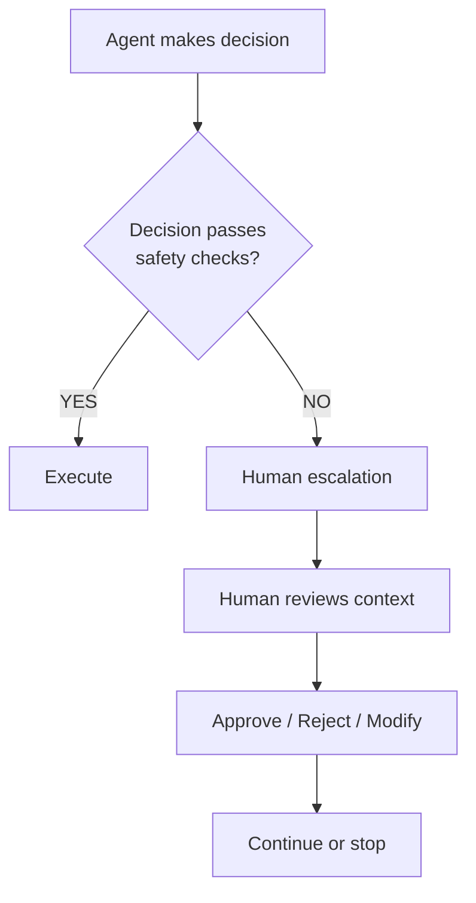
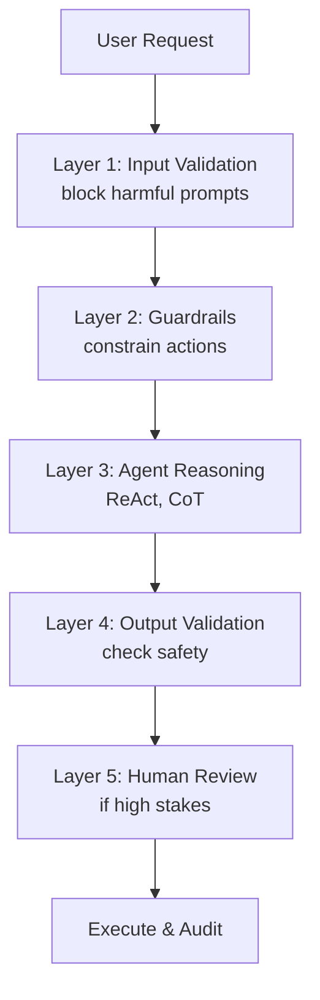

# Safety, Ethics, and Compliance in Agentic AI (Domain 9)

## Overview

This domain covers how to build agentic systems that are safe, ethical, and compliant with regulations. It includes error handling, governance, human oversight, and responsible AI practices.

---

## Part 1: Safety and Reliability

### Error Handling Framework

Agentic systems interact with external tools and APIs that can fail. A comprehensive error handling strategy is essential.

#### Error Types and Responses

| Error Type | Cause | Strategy | Example |
|---|---|---|---|
| **Transient Errors** | Network timeout, rate limit, temporary unavailable | Retry with exponential backoff | API timeout → wait 1s, retry |
| **Tool Failures** | Invalid tool call, wrong parameters, tool bug | Fallback tool or manual fix | Calculator fails → use different tool |
| **Invalid Data** | LLM produces malformed output, invalid parameters | Validation + re-prompt | Tool call has missing parameters |
| **Critical Failures** | Unrecoverable error, dangerous action required | Human escalation | System about to make major financial decision |
| **Logic Errors** | Agent made wrong decision or produced wrong answer | Self-correction | Tool result contradicts reasoning |

#### Retry Strategies

```
Exponential Backoff:
  Attempt 1: immediate
  Attempt 2: wait 1 second
  Attempt 3: wait 2 seconds
  Attempt 4: wait 4 seconds
  Attempt 5: wait 8 seconds
  Max: give up and escalate

Why exponential? Prevents hammering a struggling service
```

#### Best Practices

| Practice | Implementation | Benefit |
|---|---|---|
| **Set timeouts** | `timeout=30` on all API calls | Don't wait forever for slow tools |
| **Log all errors** | Structured logging with context | Debug and monitor issues |
| **Validate outputs** | Check tool responses before using | Catch malformed results early |
| **Limit retries** | Max 3-5 attempts | Avoid infinite loops |
| **Provide context** | Include error in agent's next prompt | Help agent understand what went wrong |

### Fault Tolerance with Checkpointing

Modern agentic systems use checkpointing for fault tolerance:

```python
# LangGraph pattern
from langgraph.checkpoint import PostgresSaver

checkpointer = PostgresSaver("postgresql://...")
app = graph.compile(checkpointer=checkpointer)

# If system crashes mid-execution, resume from checkpoint
result = app.invoke(
    state,
    config={"configurable": {"thread_id": "session_123"}}
)

# Later: restore from checkpoint
state = app.get_state({"configurable": {"thread_id": "session_123"}})
```

**Benefits:**
- ✅ Resume from exact point of failure
- ✅ Never lose computation progress
- ✅ Audit trail of all decisions
- ✅ Enable human intervention points

---

## Part 2: Human Oversight and Control

### Human-in-the-Loop Modes

From AutoGen and other frameworks, key modes for human control:

| Mode | LLM Behavior | Human Role | Best For |
|---|---|---|---|
| **ALWAYS** | Agent thinks and proposes | Human approves every action | High-stakes (lending, medical) |
| **TERMINATE** | Agent runs freely | Human can terminate if needed | Experimental, lower stakes |
| **NEVER** | Fully autonomous | No human involved | Repetitive, low-risk tasks |
| **ESCALATE** | Runs with guardrails | Human handles exceptions only | Most production systems |

### Implementation Pattern



### Approval Workflows for Critical Actions

```
Task: Agent wants to DELETE customer data

1. Identify action severity (HIGH)
2. Check automated guardrails
   - Is customer requesting deletion? ✓
   - Is account verified? ✓
   - Is there a waiting period? ✓
3. If any guardrail fails → Escalate to human
4. If all pass → Agent executes with audit logging
5. Log: WHO, WHAT, WHEN, WHY
```

### Human Feedback Incorporation

Agents should learn from human corrections:

```
Agent: "Customer credit limit increased to $10,000"
Human: "Too high, reduce to $5,000"

Agent stores this feedback:
- Request was too aggressive
- Reduce future limit recommendations by 50%
- Flag similar requests for manual review

Next request: Agent proposes $5,000 (learned from feedback)
```

---

## Part 3: Governance and Compliance

### Data Protection

| Aspect | Implementation | Compliance |
|---|---|---|
| **Access Control** | Only authorized agents access sensitive data | GDPR, HIPAA |
| **Data Masking** | Redact PII in logs and outputs | GDPR, SOC2 |
| **Retention** | Delete data after period or on request | GDPR Right to Deletion |
| **Encryption** | All data encrypted in transit and at rest | HIPAA, SOC2 |
| **Audit Logs** | Immutable logs of all data access | SOC2, financial audits |

#### Metadata Filtering in RAG

```
Document: "Patient John Smith diagnosed with Diabetes"
Metadata: owner=dr_johnson, access_level=confidential

Retrieval: Only agents with access_level >= confidential can see this

Implementation:
- Tag all documents with access metadata
- Filter retrieval results by agent permissions
- Log all access attempts
```

### Model Monitoring and Bias

| Check | Method | Frequency |
|---|---|---|
| **Bias Detection** | Measure disparate impact across demographics | Weekly |
| **Drift Detection** | Compare predictions to ground truth | Daily |
| **Fairness Metrics** | Measure treatment equity across groups | Weekly |
| **Explainability** | Can we explain key decisions? | Per release |

---

## Part 4: Responsible AI Principles

### Transparency and Explainability

Agents should explain their reasoning:

```
Agent output:
✗ Opaque: "Loan application denied"

✓ Transparent: "Loan application denied because:
   - Debt-to-income ratio exceeds 43% (actual: 47%)
   - Credit score below threshold (actual: 620, needed: 650)
   - Recent missed payment (2 months ago)

   To improve: Wait 3 months or pay down existing debt"
```

### Self-Correction Patterns

Agents should verify their own outputs:

```
Agent generates answer
    ↓
Self-check: "Does this make sense?"
    ├─ Math checks out?
    ├─ Logic consistent?
    ├─ Grounded in facts?
    └─ Answer complete?
    ↓
If any check fails → Re-generate or escalate
```

### Hallucination Prevention

Hallucinations are false statements presented as facts:

| Strategy | Implementation |
|---|---|
| **Grounding** | Only cite retrieved documents, mark uncertainty |
| **Verification** | Self-RAG pattern: verify claim against context |
| **Confidence** | Only state facts with high confidence |
| **Source tracking** | Always attribute claims to sources |

**Example:**
```
✗ Hallucination: "Company revenue was $100M last year"
(Not in any document, agent made it up)

✓ Grounded: "According to Q4 earnings report, company
   revenue in Q4 was $25M (annualized to ~$100M, but not
   confirmed for full year)"
```

---

## Part 5: Production Safety System

### Multi-Layer Safety



### Guardrails Implementation

```python
# Action constraints
ALLOWED_ACTIONS = {
    "get_data": True,
    "modify_data": False,        # Blocked
    "delete_data": False,         # Blocked
    "alert_human": True,
}

# Tool constraints
MAX_COST = 10.00                 # Dollar limit per operation
MAX_RETRIES = 3                  # Attempt limit
TIMEOUT = 30                     # Seconds

# Data constraints
ACCESS_CONTROL = {
    "agent_1": ["public", "internal"],
    "agent_2": ["public"],
}
```

---

## Part 6: Compliance Frameworks

### GDPR Compliance in Agentic Systems

| Requirement | Implementation |
|---|---|
| **Consent** | Agents must have user consent before processing data |
| **Purpose** | Data used only for stated purpose |
| **Minimization** | Collect/store only necessary data |
| **Deletion** | Delete data upon request (right to be forgotten) |
| **Portability** | Provide data in standard format if requested |
| **Accountability** | Document all processing and decisions |

### Financial Services Compliance

For agents handling finance (lending, trading, etc.):

| Requirement | Implementation |
|---|---|
| **Fairness** | No discrimination based on protected classes |
| **Transparency** | Explain why credit was approved/denied |
| **Auditability** | Every decision logged and reviewable |
| **Bias Testing** | Regular testing for disparate impact |
| **Human Override** | Humans can override agent decisions |

---

## Part 7: Monitoring and Incident Response

### Safety Dashboard Metrics

Monitor continuously:

1. **Error Rate** (should be < 1%)
2. **Escalation Rate** (track human interventions)
3. **Hallucination Rate** (detected false claims)
4. **Bias Metrics** (disparate impact by group)
5. **Latency** (unusual delays indicate issues)
6. **Cost Overruns** (runaway tool calls)

### Incident Response Process

```
Incident Detected (e.g., high error rate)
    ↓
1. Alert: Page on-call engineer
2. Investigate: Check logs, recent changes
3. Contain: Reduce traffic, kill problematic batch
4. Fix: Roll back, patch, or escalate to team
5. Monitor: Watch metrics for 1 hour
6. Post-mortem: Document root cause and prevention
```

---

## Exam-Focused Summary

**Domain 9 tests:**
- ✅ Error handling strategies (retry, fallback, escalation)
- ✅ Human-in-the-loop modes (ALWAYS, NEVER, ESCALATE)
- ✅ Governance frameworks (GDPR, SOC2, fairness)
- ✅ Hallucination prevention
- ✅ Bias detection and mitigation
- ✅ Audit trails and compliance logging
- ✅ Safety guardrails and constraints

**Key exam patterns:**
- "Agent keeps timing out?" → Increase timeout, add fallback
- "How to prevent hallucinations?" → Use Self-RAG or grounding
- "GDPR compliance?" → Implement data deletion, consent, audit logs
- "High-stakes decision?" → Use ALWAYS mode, log extensively
- "Detect bias?" → Track metrics by demographic, measure disparate impact

---

## Related Concepts

- **Error Handling** (01-agent-architecture): Detailed error strategies
- **LangGraph Checkpointing** (02-agent-development): Fault tolerance
- **RAG Safety** (06-knowledge-integration): Hallucination in retrieval
- **Human-AI Interaction** (10): Oversight and transparency
